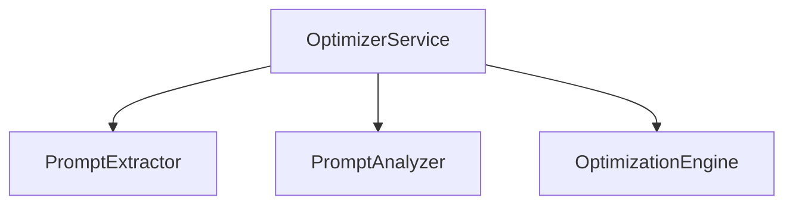

# 文档维护指南

**版本**: 1.0
**最后更新**: 2025-11-19
**适用范围**: dify_autoopt项目所有技术文档

---

## 📋 目录

1. [文档组织结构](#文档组织结构)
2. [文档分类规则](#文档分类规则)
3. [文档命名规范](#文档命名规范)
4. [文档编写规范](#文档编写规范)
5. [文档维护流程](#文档维护流程)
6. [最佳实践](#最佳实践)
7. [常见问题](#常见问题)

---

## 文档组织结构

### 目录结构说明

```
dify_autoopt/
├── README.md                          # 项目主README (入口文档)
├── config/
│   ├── README.md                      # 配置目录总体说明
│   ├── llm.yaml.example               # LLM配置���例
│   └── workflows.yaml.example         # 工作流配置示例
├── src/
│   ├── optimizer/
│   │   ├── README.md                  # Optimizer模块文档 (1338行)
│   │   ├── LLM_OPTIMIZATION_STRATEGIES.md  # LLM策略说明
│   │   └── config/
│   │       └── README.md              # Optimizer配置文档
│   ├── collector/
│   │   └── README.md                  # Collector模块文档
│   └── executor/
│       └── README.md                  # Executor模块文档
└── docs/
    ├── README.md                      # 文档索引 (本目录入口)
    ├── DOCUMENTATION_GUIDE.md         # 文档维护指南 (本文件)
    ├── CONFIG_ARCHITECTURE_DECISION.md # 配置架构决策
    ├── project.md                     # 项目总体说明
    ├���─ optimizer/                     # Optimizer模块技术文档 (37个文件)
    │   ├── LLM_INTEGRATION_ARCHITECTURE.md
    │   ├── OPTIMIZER_COMPLETE_DELIVERY_REPORT.md
    │   └── ...
    ├── collector/                     # Collector模块技术文档 (5个文件)
    │   ├── IMPLEMENTATION_SUMMARY.md
    │   └── ...
    ├── executor/                      # Executor模块技术文档 (9个文件)
    │   ├── phase3_implementation.md
    │   └── ...
    └── archive/                       # 历史文档归档 (可选)
        └── ...
```

---

## 文档分类规则

### 1. 模块README (src/<module>/README.md)

**用途**: 模块功能说明、API参考、使用示例

**内容包括**:
- ✅ 模块概述和核心功能
- ✅ 快速开始指南
- ✅ 核心组件说明
- ✅ API参考文档
- ✅ 使用示例和代码片段
- ✅ 配置说明
- ✅ 性能指标和测试覆盖率
- ✅ 最佳实践
- ✅ 故障排查

**受众**: 开发者和终端用户

**更新频率**: 随代码变更实时更新

**模板**: 参考 `src/optimizer/README.md` (生产级示例)

**示例**:
```markdown
# Module Name - Brief Description

**Status**: ✅ Production Ready
**Version**: 1.0.0
**Last Updated**: 2025-11-19

## Quick Start
...

## Core Components
...

## API Reference
...
```

---

### 2. 配置文档

#### 2.1 系统级配置 (config/README.md)

**用途**: 环境配置、API密钥管理、配置文件说明

**内容包括**:
- ✅ 配置文件列表和用途
- ✅ 配置加载方式
- ✅ 环境变量说明
- ✅ 安全最佳实践
- ✅ 配置示例

**受众**: 运维人员和开发者

**更新频率**: 配置项变更时更新

---

#### 2.2 模块级配置 (src/<module>/config/README.md)

**用途**: 模块专用配置逻辑、配置类说明

**内容包括**:
- ✅ 配置类API文档
- ✅ 配置加载流程
- ✅ 配置验证规则
- ✅ 使用示例

**受众**: 模块开发者

**更新频率**: 配置代码变更时更新

---

### 3. 架构文档 (docs/<module>/*_ARCHITECTURE.md)

**用途**: 设计决策、架构原理、技术选型

**内容包括**:
- ✅ 架构设计目标
- ✅ 组件关系图
- ✅ 数据流图
- ✅ 技术选型理由
- ✅ 设计权衡和限制
- ✅ 未来演进计划

**受众**: 架构师和高级开发者

**更新频率**: 架构重构时更新

**命名规范**:
- `<MODULE>_ARCHITECTURE.md` - 模块架构总览
- `<FEATURE>_ARCHITECTURE.md` - 特性架构设计
- `*_ARCHITECTURE_DECISION.md` - 架构决策记录

**示例**:
```markdown
# Feature Architecture

**Version**: 1.0
**Date**: 2025-11-19
**Status**: Approved

## Design Goals
...

## Architecture Overview
[Mermaid diagrams]

## Technology Selection
...

## Risk Assessment
...
```

---

### 4. 实施文档 (docs/<module>/IMPLEMENTATION_*.md)

**用途**: 实施计划、开发指南、实施总结

**内容包括**:
- ✅ 实施阶段划分
- ✅ 任务分解和检查清单
- ✅ 依赖关系
- ✅ 实施进度
- ✅ 遇到的问题和解决方案

**受众**: 开发团队

**更新频率**: 实施阶段完成时更新

**命名规范**:
- `IMPLEMENTATION_GUIDE.md` - 实施指南
- `IMPLEMENTATION_CHECKLIST.md` - 实施清单
- `IMPLEMENTATION_SUMMARY.md` - 实施总结
- `phase<N>_implementation.md` - 分阶段实施文档

---

### 5. 测试文档 (docs/<module>/TEST_*.md)

**用途**: 测试报告、缺陷跟踪、测试用例

**内容包括**:
- ✅ 测试覆盖率
- ✅ 测试结果统计
- ✅ 已知问题和缺陷
- ✅ 测试用例列表
- ✅ 性能测试结果

**受众**: QA工程师和开发者

**更新频率**: 测试轮次完成时更新

**命名规范**:
- `TEST_REPORT_*.md` - 测试报告
- `*_test_report.md` - 测试报告 (小写)
- `*_defect_tracking.md` - 缺陷跟踪
- `test_case_catalog.md` - 测试用例目录

---

### 6. 交付文档 (docs/<module>/DELIVERY_*.md)

**用途**: 项目交付报告、版本发布说明

**内容包括**:
- ✅ 交付内容清单
- ✅ 功能完成度
- ✅ 已知限制
- ✅ 后续改进建议
- ✅ 验收标准

**受众**: 项目经理和客户

**更新频率**: 项目里程碑完成时创建

**命名规范**:
- `DELIVERY_REPORT.md` - 交付报告
- `*_MVP_DELIVERY.md` - MVP交付文档
- `*_COMPLETE_DELIVERY_REPORT.md` - 完整交付报告

---

### 7. 使用指南 (docs/<module>/*_GUIDE.md, *_USAGE.md)

**用途**: 特定功能或场景的详细使用说明

**内容包括**:
- ✅ 功能介绍
- ✅ 使用步骤
- ✅ 代码示例
- ✅ 常见场景
- ✅ 注意事项

**受众**: 开发者和用户

**更新频率**: 功能变更时更新

**命名规范**:
- `*_USAGE_GUIDE.md` - 使用指南
- `*_GUIDE.md` - 指南
- `*_USAGE.md` - 使用说明

---

### 8. 临时文档 (docs/archive/*.md)

**用途**: 交付报告、开发记录、历史文档

**处理方式**:
- ✅ 完成后移动到 `docs/archive/`
- ✅ 或在文档头部标注 `[ARCHIVED]`
- ✅ 重要文档保留,临时记录可删除

**受众**: 项目团队

**更新频率**: 归档后不再更新

---

## 文档命名规范

### 命名原则

1. **大小写规范**:
   - **推荐**: `UPPERCASE_WITH_UNDERSCORES.md` (重要文档)
   - **允许**: `lowercase_with_underscores.md` (一般文档)
   - **避免**: `camelCase.md`, `混合-风格.md`

2. **语义明确**:
   - ✅ `LLM_INTEGRATION_ARCHITECTURE.md` (清晰)
   - ❌ `doc1.md`, `notes.md` (模糊)

3. **前缀分类**:
   - `ARCHITECTURE_*` - 架构文档
   - `IMPLEMENTATION_*` - 实施文档
   - `TEST_REPORT_*` - 测试报告
   - `DELIVERY_*` - 交付文档

4. **模块标识**:
   - `OPTIMIZER_*.md` - Optimizer模块
   - `COLLECTOR_*.md` - Collector模块
   - `EXECUTOR_*.md` - Executor模块

### 命名示例

| 文档类型 | 推荐命名 | 说明 |
|---------|---------|------|
| 模块README | `README.md` | 固定名称 |
| 架构文档 | `LLM_INTEGRATION_ARCHITECTURE.md` | 特性_ARCHITECTURE |
| 实施指南 | `IMPLEMENTATION_GUIDE.md` | IMPLEMENTATION_类型 |
| 测试报告 | `TEST_REPORT_OPTIMIZER.md` | TEST_REPORT_模块 |
| 交付文档 | `OPTIMIZER_COMPLETE_DELIVERY_REPORT.md` | 模块_类型_REPORT |
| 使用指南 | `SINGLE_NODE_EXTRACTION_GUIDE.md` | 功能_GUIDE |
| Phase文档 | `phase3_implementation.md` | phase<N>_类型 |

---

## 文档编写规范

### 1. Markdown格式

**标准**: 使用标准Markdown语法 (CommonMark)

**必须包含**:
- ✅ 文档标题 (`# Title`)
- ✅ 元数据 (版本、日期、状态)
- ✅ 目录 (长文档 > 200行)
- ✅ 章节标题 (`##`, `###`)

**推荐使用**:
- ✅ 代码块 (带语言标识)
- ✅ 表格 (对��数据)
- ✅ 列表 (结构化内容)
- ✅ 链接 (引用其他文档)
- ✅ Emoji (增强可读性) - 适度使用

**避免**:
- ❌ HTML标签 (除非必需)
- ❌ 行内样式
- ❌ 过度嵌套 (> 4层)

---

### 2. 文档头部模板

```markdown
# 文档标题

**版本**: 1.0
**日期**: 2025-11-19
**状态**: [Draft | In Review | Approved | Archived]
**作者**: [团队名称]

---

## 目录

1. [章节1](#章节1)
2. [章节2](#章节2)

---

## 章节1
...
```

---

### 3. 代码示例规范

**要求**:
- ✅ 使用语法高亮 (````python`, ```yaml`, ```bash`)
- ✅ 包含注释说明
- ✅ 可���行的完整示例
- ✅ 避免硬编码敏感信息

**示例**:

````markdown
```python
from src.optimizer import OptimizerService

# Initialize optimizer service
service = OptimizerService(catalog=catalog)

# Run optimization
patches = service.run_optimization_cycle("wf_001")
print(f"Generated {len(patches)} patches")
```
````

---

### 4. 链接引用规范

**相对路径**: 使用相对路径引用项目内文档

```markdown
- **配置说明**: `../config/README.md`
- **模块文档**: `../src/optimizer/README.md`
- **架构设计**: `optimizer/LLM_INTEGRATION_ARCHITECTURE.md`
```

**绝对路径**: 仅用于外部资源

```markdown
- **Markdown规范**: https://commonmark.org/
```

---

### 5. 图表规范

**推荐工具**:
- ✅ Mermaid (流程图、架构图)
- ✅ ASCII Art (简单图表)
- ✅ 表格 (数据对比)

**Mermaid示例**:

````markdown

````

---

### 6. 版本和日期标注

**必须标注**:
- ✅ 创建日期: `**创建日期**: 2025-11-19`
- ✅ 最后更新: `**最后更新**: 2025-11-19`
- ✅ 版本号: `**版本**: 1.0`

**变更记录** (可选,长期维护文档):

```markdown
## 变更历史

| 版本 | 日期 | 变更内容 | 作者 |
|------|------|---------|------|
| 1.1 | 2025-11-19 | 添加LLM配置章节 | Team |
| 1.0 | 2025-11-18 | 初始版本 | Team |
```

---

## 文档维护流程

### 新增文档

1. **确定文档类型**:
   - 模块README? → `src/<module>/README.md`
   - 架构设计? → `docs/<module>/ARCHITECTURE_*.md`
   - 实施文档? → `docs/<module>/IMPLEMENTATION_*.md`
   - 测试报告? → `docs/<module>/TEST_*.md`

2. **选择文档位置**:
   - 遵循 [文档组织结构](#文档组织结构)
   - 确保目录存在: `mkdir -p docs/<module>`

3. **使用命名规范**:
   - 参考 [文档命名规范](#文档命名规范)
   - 使用语义化文件名

4. **编写文档内��**:
   - 使用 [文档头部模板](#2-文档头部模板)
   - 遵循 [文档编写规范](#文档编写规范)

5. **更新文档索引**:
   - 在 `docs/README.md` 添加链接
   - 更新模块README的"Additional Resources"章节

6. **提交代码**:
   ```bash
   git add docs/<module>/NEW_DOCUMENT.md
   git add docs/README.md
   git commit -m "docs: add <module> NEW_DOCUMENT"
   ```

---

### 更新文档

1. **修改文档内容**:
   - 更新 `**最后更新**` 日期
   - 重大变更时增加版本号
   - 在变更记录中添加条目 (可选)

2. **检查引用链接**:
   ```bash
   # 搜索引用该文档的其他文档
   grep -r "OLD_DOCUMENT.md" docs/
   ```

3. **更新相关文档**:
   - 如果修改了API,同步更新模块README
   - 如果修改了配置,同步更新配置文档

4. **提交代码**:
   ```bash
   git add docs/<module>/UPDATED_DOCUMENT.md
   git commit -m "docs: update <module> UPDATED_DOCUMENT - <change summary>"
   ```

---

### 删除文档

1. **检查引用**:
   ```bash
   # 搜索所有引用
   grep -r "TO_DELETE.md" .
   ```

2. **选择处理方式**:
   - **归档**: 移动到 `docs/archive/`
   - **删除**: 确认无引用后直接删除

3. **归档处理**:
   ```bash
   mkdir -p docs/archive/<module>
   git mv docs/<module>/OLD_DOCUMENT.md docs/archive/<module>/
   ```

4. **更新索引**:
   - 从 `docs/README.md` 移除链接
   - 从模块README移除引用

5. **提交代码**:
   ```bash
   git add docs/README.md
   git add docs/archive/
   git commit -m "docs: archive <module> OLD_DOCUMENT"
   ```

---

### 文档审查清单

在提交文档前,使用以下清单审查:

- [ ] 文档标题清晰准确
- [ ] 包含版本、日期、状态
- [ ] 长文档包含目录
- [ ] 代码示例可执行
- [ ] 无敏感信息泄露
- [ ] 链接路径正确
- [ ] 已更新文档索引
- [ ] Markdown格式正确
- [ ] 拼写检查通过

---

## 最佳实践

### 1. 保持文档与代码同步

**原则**: 代码变更时,同步更新文档

**实施**:
- ✅ 在PR中包含文档更新
- ✅ 使用git hooks检查文档完整性
- ✅ Code Review时检查文档一致性

**示例**:
```bash
# 修改代码后
git add src/optimizer/optimizer_service.py

# 同时更新文档
git add src/optimizer/README.md
git add docs/optimizer/OPTIMIZER_USAGE_GUIDE.md

git commit -m "feat(optimizer): add LLM stats API

- Add get_llm_stats() method
- Update README with usage example
- Update usage guide with cost tracking"
```

---

### 2. 单一来源原则

**���则**: 避免重复内容,使用链接引用

**问题**: 多处维护相同内容导致不一致

**解决**:
- ✅ 在一处定义,其他文档链接引用
- ✅ 模块README为主要来源
- ✅ 技术细节在专门文档中

**示例**:

在 `src/optimizer/README.md`:
```markdown
## LLM Configuration

详细配置说明见: `config/README.md` 和 `src/optimizer/config/README.md`
```

在 `docs/optimizer/IMPLEMENTATION_GUIDE.md`:
```markdown
## Step 3: Configure LLM

参考配置文档: `../../config/README.md`
```

---

### 3. 使用语义化版本

**原则**: 重大变更增加版本号

**版本号规则**:
- `1.0` → `1.1`: 小改动 (新增章节、示例)
- `1.0` → `2.0`: 大改动 (架构重构、API变更)

**标注方式**:
```markdown
**版本**: 2.0
**变更**: 添加LLM集成架构章节,重构配置说明
```

---

### 4. 及时归档过时文档

**原则**: 不删除,而是归档

**归档时机**:
- ✅ 功能已废弃但文档仍有参考价值
- ✅ 历史设计文档
- ✅ 已完成的交付报告

**归档方式**:
```bash
# 创建归档目录
mkdir -p docs/archive/optimizer

# 移动文档
git mv docs/optimizer/OLD_DESIGN.md docs/archive/optimizer/

# 在README中标注
echo "[ARCHIVED] 见 docs/archive/optimizer/OLD_DESIGN.md" >> docs/README.md
```

---

### 5. 编写可执行的代码示例

**原则**: 所有代码示例应能直接复制运行

**要求**:
- ✅ 包含必要的import语句
- ✅ 使用真实的类名和方法名
- ✅ 避免伪代码 (除非明确标注)
- ✅ 提供完整的上下文

**示例**:

❌ 不好的示例:
```python
# 优化工作流
service.optimize(...)
```

✅ 好的示例:
```python
from src.optimizer import OptimizerService
from src.config import ConfigLoader

# 加载配置
loader = ConfigLoader()
catalog = loader.load_catalog("config/workflows.yaml")

# 初始化服务
service = OptimizerService(catalog=catalog)

# 运行优化
patches = service.run_optimization_cycle("wf_001", strategy="auto")
print(f"Generated {len(patches)} patches")
```

---

### 6. 使用视觉元素增强可读性

**Emoji使用**:
- ✅ 状态标识: `✅ 完成`, `⏳ 进行中`, `❌ 未实现`
- ✅ 优先级: `🔥 Critical`, `⚠️ High`, `ℹ️ Low`
- ✅ 章节图标: `📚 文档`, `🔧 配置`, `🚀 快速开始`

**表格对比**:
```markdown
| 方案 | 优点 | 缺点 | 推荐度 |
|------|------|------|--------|
| 方案A | 简单 | 性能低 | ⭐⭐ |
| 方案B | 高性能 | 复杂 | ⭐⭐⭐⭐ |
```

**代码块高亮**:
````markdown
```python
# 重点部分使用注释突出
config = LLMConfig(
    provider="openai",  # 👈 关键配置
    model="gpt-4"
)
```
````

---

## 常��问题

### Q1: 文档应该放在哪里?

**A**: 根据文档类型选择:

| 文档类型 | 位置 |
|---------|------|
| 模块功能和API | `src/<module>/README.md` |
| 模块配置说明 | `src/<module>/config/README.md` |
| 架构设计文档 | `docs/<module>/*_ARCHITECTURE.md` |
| 实施和测试文档 | `docs/<module>/IMPLEMENTATION_*.md` |
| 系统级架构 | `docs/CONFIG_ARCHITECTURE_DECISION.md` |
| 环境配置说明 | `config/README.md` |

---

### Q2: 如何避免文档重复?

**A**: 使用链接引用,遵循单一来源原则

```markdown
<!-- 在次要文档中 -->
详细配置说明见主文档: [LLM配置](../../config/README.md#llm配置)

<!-- 在模块README中 -->
架构设计详见: [LLM集成架构](../../docs/optimizer/LLM_INTEGRATION_ARCHITECTURE.md)
```

---

### Q3: 文档更新后需要做什么?

**A**: 完成以下检查清单:

1. ✅ 更新文档头部的"最后更新"日期
2. ✅ 检查引用该文档的其他文档
3. ✅ 更新 `docs/README.md` 索引 (如果新增文档)
4. ✅ 运行拼写检查
5. ✅ 在git commit message中说明变更

---

### Q4: 如何处理过时的文档?

**A**: 不要直接删除,使用归档机制:

```bash
# 方案1: 移动到archive目录
git mv docs/optimizer/OLD_DOC.md docs/archive/optimizer/

# 方案2: 在文档头部标注
echo "[ARCHIVED] This document is outdated. See NEW_DOC.md" > OLD_DOC.md

# 方案3: 在README中标注废弃
```

---

### Q5: 如何保证代码示例正确?

**A**: 建议流程:

1. ✅ 在实际代码库中测试代码示例
2. ✅ 使用真实的类名、方法名、参数
3. ✅ 包含完整的import语句
4. ✅ 提供上下文 (如何获取catalog对象)
5. ✅ 在CI中运行文档示例测试 (可选)

---

### Q6: 多长的文档需要目录?

**A**: 建议���则:

- < 100行: 可选
- 100-200行: 推荐
- \> 200行: 必须

**目录生成**:
```markdown
## 目录

- [章节1](#章节1)
- [章节2](#章节2)
  - [子章节2.1](#子章节21)
```

---

### Q7: 如何编写用户友好的错误排查文档?

**A**: 使用问题-解决方案格式:

```markdown
## 故障排查

### 问题: 无法提取提示词

**症状**:
- `extract_from_workflow()` 返回空列表
- 日志显示 "No LLM nodes found"

**可能原因**:
1. 工作流DSL格式不正确
2. 节点类型不是LLM节点

**解决方案**:
\```python
# 检查DSL结构
extractor = PromptExtractor()
dsl = extractor.load_dsl_file(path)
nodes = extractor._find_nodes(dsl)
print(f"Found {len(nodes)} nodes")
\```

**参考**: 详见 TROUBLESHOOTING.md#extraction-issues
```

---

## 相关资源

- **项目README**: `../README.md`
- **文档索引**: `README.md`
- **配置文档**: `../config/README.md`
- **Markdown语法**: https://commonmark.org/
- **Mermaid图表**: https://mermaid.js.org/

---

**维护者**: dify_autoopt团队
**联系方式**: 项目Issue Tracker
**最后更新**: 2025-11-19
