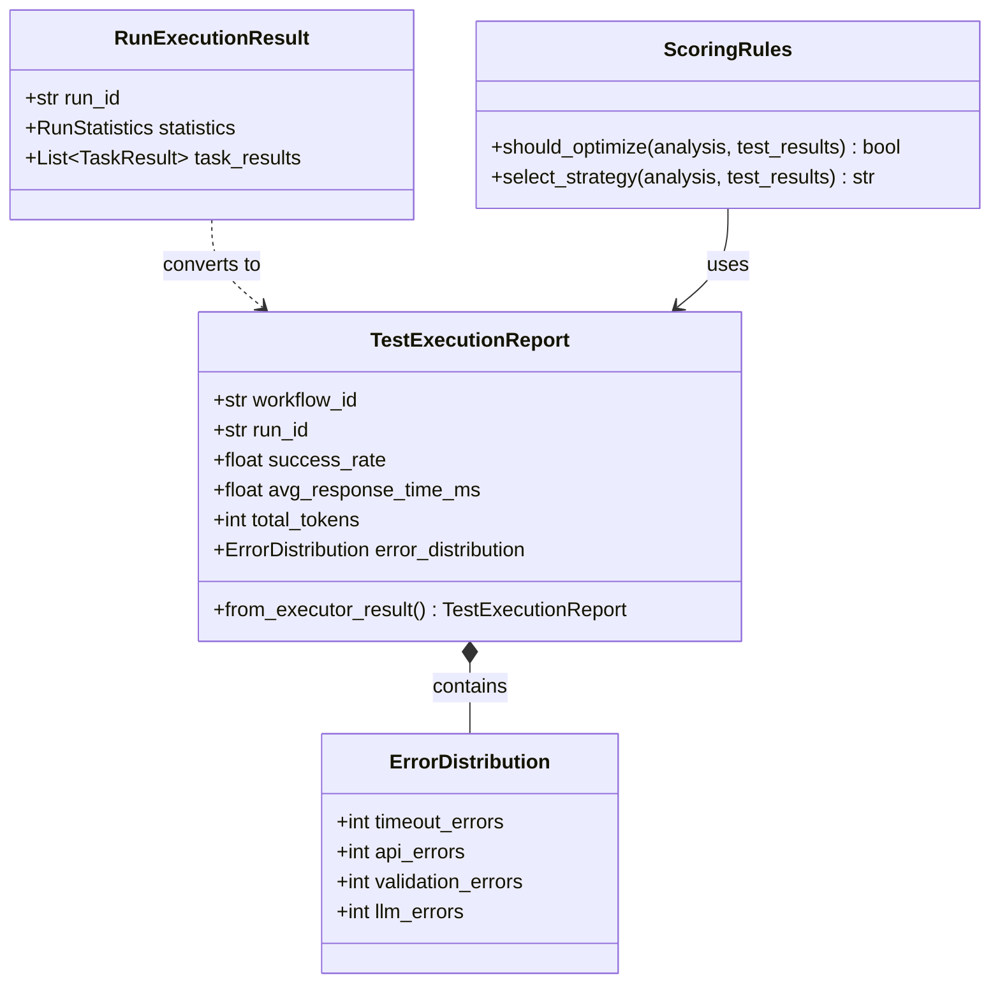
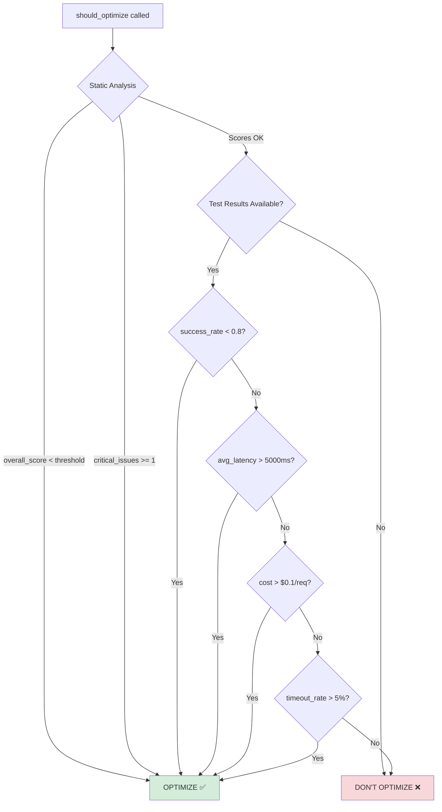

# Test-Driven Optimization Architecture Design

**Date**: 2025-11-19
**Author**: backend-architect
**Status**: Design Phase
**Version**: 1.0.0

## Executive Summary

This document outlines the architecture for integrating executor test results into optimizer decision-making, transforming optimizer from static prompt analysis to true **test-driven optimization**.

### Current State (MVP)
- ❌ Optimization decisions based solely on static prompt analysis
- ❌ `baseline_metrics` parameter is a simple `Dict[str, Any]` with only `success_rate` check
- ❌ Not connected to executor module's rich test execution results

### Target State (Production)
- ✅ Optimization driven by real test execution metrics
- ✅ Multi-dimensional decision criteria (success rate, latency, cost, token usage)
- ✅ Strongly-typed integration between executor and optimizer
- ✅ Backward compatible with existing code

---

## 1. Architecture Overview

### 1.1 Data Flow


### 1.2 Module Boundaries

| Module | Responsibility | Owns |
|--------|---------------|------|
| **Executor** | Test execution, performance measurement | `RunExecutionResult`, `TaskResult` |
| **Optimizer** | Prompt analysis, optimization decisions | `PromptAnalysis`, `TestExecutionReport` |
| **ScoringRules** | Multi-criteria decision logic | Thresholds, evaluation rules |

### 1.3 Integration Strategy: **Loose Coupling via Shared Models**

**Rationale**: We choose **Option 2 (Shared Data Models)** over direct coupling or event-driven architecture because:

1. **Simplicity**: No message queue infrastructure needed (MVP → Production path)
2. **Type Safety**: Pydantic models enforce contracts at compile-time
3. **Testability**: Easy to mock `TestExecutionReport` in optimizer tests
4. **Flexibility**: Can evolve to event-driven later without breaking contracts

```python
# ✅ Recommended: Shared model in optimizer (consumer defines contract)
from src.optimizer.models import TestExecutionReport

# Executor converts its internal results to optimizer's contract
executor_result = executor_service.execute_test_plan(manifest)
test_report = TestExecutionReport.from_executor_result(executor_result)

# Optimizer uses its own model
optimizer_service.run_optimization_cycle(
    workflow_id="wf_001",
    test_results=test_report  # Strong typing
)
```

**Alternative Options Considered**:

| Option | Pros | Cons | Decision |
|--------|------|------|----------|
| Direct Coupling | Simple, fast | Tight coupling, hard to test | ❌ Rejected |
| Shared Models | Type-safe, flexible, testable | Requires conversion layer | ✅ **CHOSEN** |
| Event-Driven | Fully decoupled, scalable | Complex, over-engineering for MVP | ⏳ Future |

---

## 2. Data Model Design

### 2.1 Core Models

#### 2.1.1 TestExecutionReport (Optimizer Module)

```python
# src/optimizer/models.py

from pydantic import BaseModel, Field, field_validator
from typing import Dict, List, Optional
from datetime import datetime

class ErrorDistribution(BaseModel):
    """Error type distribution from test execution.

    Attributes:
        timeout_errors: Number of timeout errors
        api_errors: Number of API/network errors
        validation_errors: Number of validation failures
        llm_errors: Number of LLM-specific errors (rate limit, content filter)
        total_errors: Total error count
    """
    model_config = ConfigDict(extra="forbid")

    timeout_errors: int = Field(default=0, ge=0, description="Timeout error count")
    api_errors: int = Field(default=0, ge=0, description="API error count")
    validation_errors: int = Field(default=0, ge=0, description="Validation error count")
    llm_errors: int = Field(default=0, ge=0, description="LLM-specific error count")
    total_errors: int = Field(default=0, ge=0, description="Total error count")

    @field_validator("total_errors")
    @classmethod
    def validate_total_errors(cls, v: int, info) -> int:
        """Ensure total_errors matches sum of individual errors."""
        individual_sum = (
            info.data.get("timeout_errors", 0) +
            info.data.get("api_errors", 0) +
            info.data.get("validation_errors", 0) +
            info.data.get("llm_errors", 0)
        )
        if v != individual_sum:
            raise ValueError(
                f"total_errors ({v}) must equal sum of individual errors ({individual_sum})"
            )
        return v


class TestExecutionReport(BaseModel):
    """Aggregated test execution metrics for optimization decisions.

    This model represents the contract between executor and optimizer modules.
    It is intentionally decoupled from executor's internal models to allow
    independent evolution.

    Attributes:
        workflow_id: Workflow identifier
        run_id: Test run identifier (from executor)
        total_tests: Total number of tests executed
        successful_tests: Number of successful tests
        failed_tests: Number of failed tests
        success_rate: Success rate (0.0-1.0)
        avg_response_time_ms: Average response time in milliseconds
        p95_response_time_ms: 95th percentile response time
        p99_response_time_ms: 99th percentile response time
        total_tokens: Total tokens consumed across all tests
        avg_tokens_per_request: Average tokens per request
        total_cost: Total cost in USD
        cost_per_request: Average cost per request in USD
        error_distribution: Error type distribution
        executed_at: Execution timestamp
        metadata: Additional execution metadata
    """
    model_config = ConfigDict(extra="forbid", validate_assignment=True)

    # Identifiers
    workflow_id: str = Field(..., description="Workflow ID")
    run_id: str = Field(..., description="Test run ID from executor")

    # Test counts
    total_tests: int = Field(..., ge=1, description="Total tests executed")
    successful_tests: int = Field(..., ge=0, description="Successful tests")
    failed_tests: int = Field(..., ge=0, description="Failed tests")

    # Success metrics
    success_rate: float = Field(
        ...,
        ge=0.0,
        le=1.0,
        description="Success rate (0.0-1.0)"
    )

    # Performance metrics
    avg_response_time_ms: float = Field(
        ...,
        ge=0.0,
        description="Average response time (ms)"
    )
    p95_response_time_ms: Optional[float] = Field(
        None,
        ge=0.0,
        description="95th percentile response time (ms)"
    )
    p99_response_time_ms: Optional[float] = Field(
        None,
        ge=0.0,
        description="99th percentile response time (ms)"
    )

    # Token and cost metrics
    total_tokens: int = Field(..., ge=0, description="Total tokens consumed")
    avg_tokens_per_request: float = Field(
        ...,
        ge=0.0,
        description="Average tokens per request"
    )
    total_cost: float = Field(..., ge=0.0, description="Total cost (USD)")
    cost_per_request: float = Field(
        ...,
        ge=0.0,
        description="Average cost per request (USD)"
    )

    # Error analysis
    error_distribution: ErrorDistribution = Field(
        default_factory=ErrorDistribution,
        description="Error type distribution"
    )

    # Metadata
    executed_at: datetime = Field(
        default_factory=datetime.now,
        description="Execution timestamp"
    )
    metadata: Dict[str, Any] = Field(
        default_factory=dict,
        description="Additional metadata"
    )

    @field_validator("success_rate")
    @classmethod
    def validate_success_rate_consistency(cls, v: float, info) -> float:
        """Ensure success_rate matches successful_tests / total_tests."""
        total = info.data.get("total_tests")
        successful = info.data.get("successful_tests")

        if total and successful is not None:
            expected_rate = successful / total
            # Allow small floating point differences
            if abs(v - expected_rate) > 0.001:
                raise ValueError(
                    f"success_rate ({v:.3f}) inconsistent with "
                    f"successful_tests/total_tests ({expected_rate:.3f})"
                )
        return v

    @classmethod
    def from_executor_result(
        cls,
        executor_result: "RunExecutionResult"  # From executor.models
    ) -> "TestExecutionReport":
        """Convert executor's RunExecutionResult to TestExecutionReport.

        This factory method decouples executor and optimizer modules by
        providing a conversion layer.

        Args:
            executor_result: RunExecutionResult from executor module

        Returns:
            TestExecutionReport for optimizer consumption

        Example:
            >>> from src.executor.models import RunExecutionResult
            >>> exec_result = executor_service.execute_test_plan(manifest)
            >>> test_report = TestExecutionReport.from_executor_result(exec_result)
        """
        from src.executor.models import TaskStatus

        stats = executor_result.statistics

        # Calculate percentiles from task_results
        response_times = [
            tr.execution_time * 1000  # Convert to ms
            for tr in executor_result.task_results
            if tr.execution_time > 0
        ]

        p95 = None
        p99 = None
        if response_times:
            import statistics
            response_times_sorted = sorted(response_times)
            p95_idx = int(len(response_times_sorted) * 0.95)
            p99_idx = int(len(response_times_sorted) * 0.99)
            p95 = response_times_sorted[p95_idx] if p95_idx < len(response_times_sorted) else None
            p99 = response_times_sorted[p99_idx] if p99_idx < len(response_times_sorted) else None

        # Analyze error distribution
        error_dist = ErrorDistribution(
            timeout_errors=stats.timeout_tasks,
            api_errors=stats.error_tasks,
            validation_errors=0,  # Executor doesn't track this separately
            llm_errors=0,  # Would need to parse error messages
            total_errors=stats.failed_tasks + stats.timeout_tasks + stats.error_tasks
        )

        return cls(
            workflow_id=executor_result.workflow_id,
            run_id=executor_result.run_id,
            total_tests=stats.total_tasks,
            successful_tests=stats.succeeded_tasks,
            failed_tests=stats.failed_tasks + stats.timeout_tasks + stats.error_tasks,
            success_rate=stats.success_rate,
            avg_response_time_ms=stats.avg_execution_time * 1000,  # Convert to ms
            p95_response_time_ms=p95,
            p99_response_time_ms=p99,
            total_tokens=stats.total_tokens,
            avg_tokens_per_request=(
                stats.total_tokens / stats.completed_tasks
                if stats.completed_tasks > 0 else 0.0
            ),
            total_cost=stats.total_cost,
            cost_per_request=(
                stats.total_cost / stats.completed_tasks
                if stats.completed_tasks > 0 else 0.0
            ),
            error_distribution=error_dist,
            executed_at=executor_result.finished_at,
            metadata={
                "total_retries": stats.total_retries,
                "cancelled_tasks": stats.cancelled_tasks
            }
        )

    def has_timeout_errors(self) -> bool:
        """Check if execution had timeout errors."""
        return self.error_distribution.timeout_errors > 0

    def has_api_errors(self) -> bool:
        """Check if execution had API errors."""
        return self.error_distribution.api_errors > 0

    def get_error_rate(self) -> float:
        """Calculate overall error rate."""
        return 1.0 - self.success_rate
```

### 2.2 Model Relationships



---

## 3. Interface Design

### 3.1 Updated ScoringRules.should_optimize()

```python
# src/optimizer/scoring_rules.py

from typing import Optional, Any
from .models import PromptAnalysis, TestExecutionReport

@dataclass
class ScoringRules:
    """Configurable scoring thresholds and rules.

    Attributes:
        # Existing attributes...
        optimization_threshold: float = 80.0
        critical_issue_threshold: int = 1

        # NEW: Test-based thresholds
        min_success_rate: float = 0.8
        max_acceptable_latency_ms: float = 5000.0
        max_cost_per_request: float = 0.1
        max_timeout_error_rate: float = 0.05
    """

    # Existing thresholds
    optimization_threshold: float = 80.0
    critical_issue_threshold: int = 1
    clarity_efficiency_gap: float = 10.0
    low_score_threshold: float = 70.0
    min_confidence: float = 0.6
    high_confidence: float = 0.8
    major_version_min_improvement: float = 15.0
    minor_version_min_improvement: float = 5.0

    # NEW: Test-based optimization triggers
    min_success_rate: float = 0.8
    max_acceptable_latency_ms: float = 5000.0
    max_cost_per_request: float = 0.1
    max_timeout_error_rate: float = 0.05

    def should_optimize(
        self,
        analysis: PromptAnalysis,
        test_results: Optional[TestExecutionReport] = None,  # CHANGED: Strong typing
        config: Optional[Any] = None,
    ) -> bool:
        """Determine if optimization is needed based on static analysis AND test results.

        Decision Logic:
            1. Static Analysis Criteria (unchanged):
               - Low overall score (< optimization_threshold)
               - Critical issues present

            2. Test-Based Criteria (NEW):
               - Low success rate (< min_success_rate)
               - High latency (> max_acceptable_latency_ms)
               - High cost (> max_cost_per_request)
               - Excessive timeout errors (> max_timeout_error_rate)

        Args:
            analysis: Prompt analysis result (static)
            test_results: Test execution report (optional, runtime)
            config: Optional config to override thresholds

        Returns:
            True if optimization recommended

        Backward Compatibility:
            - When test_results=None, behaves identically to old version
            - Supports legacy baseline_metrics dict via compatibility layer
        """
        # Use config's score_threshold if provided
        score_threshold = (
            config.score_threshold if config else self.optimization_threshold
        )

        # ========== Static Analysis Criteria (UNCHANGED) ==========

        # 1. Low overall score
        if analysis.overall_score < score_threshold:
            return True

        # 2. Critical issues present
        critical_issues = [
            i for i in analysis.issues
            if hasattr(i.severity, "value") and i.severity.value == "critical"
        ]
        if len(critical_issues) >= self.critical_issue_threshold:
            return True

        # ========== Test-Based Criteria (NEW) ==========

        if test_results:
            # 3. Low success rate
            if test_results.success_rate < self.min_success_rate:
                return True

            # 4. High average latency
            if test_results.avg_response_time_ms > self.max_acceptable_latency_ms:
                return True

            # 5. High cost per request
            if test_results.cost_per_request > self.max_cost_per_request:
                return True

            # 6. Excessive timeout errors
            timeout_rate = (
                test_results.error_distribution.timeout_errors / test_results.total_tests
                if test_results.total_tests > 0 else 0.0
            )
            if timeout_rate > self.max_timeout_error_rate:
                return True

        return False

    def select_strategy(
        self,
        analysis: PromptAnalysis,
        test_results: Optional[TestExecutionReport] = None,  # NEW parameter
    ) -> str:
        """Select best optimization strategy based on analysis and test results.

        Strategy Selection Logic:
            - Clarity focus: Low clarity score OR high timeout errors (suggests unclear prompts)
            - Efficiency focus: Low efficiency score OR high token usage
            - Structure focus: Both scores low OR mixed error patterns

        Args:
            analysis: Prompt analysis
            test_results: Test execution report (optional)

        Returns:
            Strategy name
        """
        clarity = analysis.clarity_score
        efficiency = analysis.efficiency_score

        # Factor in test results if available
        if test_results:
            # High timeout errors suggest clarity issues
            if test_results.has_timeout_errors():
                timeout_rate = (
                    test_results.error_distribution.timeout_errors /
                    test_results.total_tests
                )
                if timeout_rate > 0.1:  # More than 10% timeouts
                    return "clarity_focus"

            # High token usage with low efficiency score
            # (Check if tokens are significantly above baseline)
            if efficiency < self.low_score_threshold:
                # Could compare test_results.avg_tokens_per_request
                # with a baseline threshold
                return "efficiency_focus"

        # Original logic (unchanged)
        if clarity < efficiency - self.clarity_efficiency_gap:
            return "clarity_focus"

        if efficiency < clarity - self.clarity_efficiency_gap:
            return "efficiency_focus"

        if (clarity < self.low_score_threshold and
            efficiency < self.low_score_threshold):
            return "structure_focus"

        return "clarity_focus"
```

### 3.2 Backward Compatibility Layer

```python
# src/optimizer/scoring_rules.py (continued)

def _convert_legacy_baseline_metrics(
    baseline_metrics: Optional[Dict[str, Any]]
) -> Optional[TestExecutionReport]:
    """Convert legacy baseline_metrics dict to TestExecutionReport.

    This provides backward compatibility for existing code using the old API.

    Args:
        baseline_metrics: Legacy dict with "success_rate" key

    Returns:
        TestExecutionReport if valid data, None otherwise

    Example:
        >>> legacy = {"success_rate": 0.75}
        >>> report = _convert_legacy_baseline_metrics(legacy)
        >>> assert report.success_rate == 0.75
    """
    if not baseline_metrics or "success_rate" not in baseline_metrics:
        return None

    # Create minimal TestExecutionReport from legacy data
    return TestExecutionReport(
        workflow_id=baseline_metrics.get("workflow_id", "unknown"),
        run_id=baseline_metrics.get("run_id", "legacy"),
        total_tests=baseline_metrics.get("total_tests", 1),
        successful_tests=int(
            baseline_metrics.get("total_tests", 1) * baseline_metrics["success_rate"]
        ),
        failed_tests=int(
            baseline_metrics.get("total_tests", 1) * (1 - baseline_metrics["success_rate"])
        ),
        success_rate=baseline_metrics["success_rate"],
        avg_response_time_ms=baseline_metrics.get("avg_response_time", 0.0),
        total_tokens=baseline_metrics.get("total_tokens", 0),
        avg_tokens_per_request=baseline_metrics.get("avg_tokens", 0.0),
        total_cost=baseline_metrics.get("total_cost", 0.0),
        cost_per_request=baseline_metrics.get("avg_cost", 0.0)
    )

# Update should_optimize to support both APIs
def should_optimize(
    self,
    analysis: PromptAnalysis,
    test_results: Optional[TestExecutionReport] = None,
    baseline_metrics: Optional[Dict[str, Any]] = None,  # DEPRECATED
    config: Optional[Any] = None,
) -> bool:
    """..."""
    # Compatibility: Convert legacy baseline_metrics if test_results not provided
    if test_results is None and baseline_metrics:
        test_results = _convert_legacy_baseline_metrics(baseline_metrics)

    # Rest of the method unchanged...
```

---

## 4. Decision Logic Flow



---

## 5. Implementation Plan

### Phase 1: Foundation (This PR)

**Files to Create/Modify**:

1. **src/optimizer/models.py** (MODIFY)
   - Add `ErrorDistribution` class
   - Add `TestExecutionReport` class
   - Add factory method `TestExecutionReport.from_executor_result()`

2. **src/optimizer/scoring_rules.py** (MODIFY)
   - Update `ScoringRules` dataclass with new thresholds
   - Update `should_optimize()` signature and logic
   - Update `select_strategy()` to consider test results
   - Add backward compatibility layer

3. **src/test/optimizer/test_scoring_rules_test_driven.py** (CREATE)
   - Test `should_optimize()` with test results
   - Test backward compatibility
   - Test error distribution logic
   - Test strategy selection with test data

4. **src/test/optimizer/test_models_test_execution.py** (CREATE)
   - Test `TestExecutionReport` validation
   - Test `from_executor_result()` conversion
   - Test error distribution calculation
   - Test helper methods

**Success Criteria**:
- ✅ All new tests pass
- ✅ 100% backward compatibility (existing tests unchanged and passing)
- ✅ Type checking passes (mypy/pyright)
- ✅ Test coverage >= 90% for new code

### Phase 2: Integration (Future PR)

1. Update optimizer service to accept test results
2. Add E2E test: Executor → Optimizer pipeline
3. Update documentation and examples
4. Add performance benchmarks

### Phase 3: Advanced Features (Future)

1. ML-based optimization recommendation
2. Complex error pattern analysis
3. Cost optimization strategies
4. Historical trend analysis

---

## 6. Testing Strategy

### 6.1 Unit Tests

```python
# src/test/optimizer/test_scoring_rules_test_driven.py

import pytest
from src.optimizer.scoring_rules import ScoringRules
from src.optimizer.models import (
    PromptAnalysis,
    TestExecutionReport,
    ErrorDistribution
)

class TestScoringRulesTestDriven:
    """Test ScoringRules with test execution results."""

    def test_should_optimize_low_success_rate(self):
        """Should optimize when success rate below threshold."""
        rules = ScoringRules(min_success_rate=0.8)

        # High static scores, but low test success rate
        analysis = PromptAnalysis(
            prompt_id="test",
            overall_score=90.0,
            clarity_score=90.0,
            efficiency_score=90.0
        )

        test_results = TestExecutionReport(
            workflow_id="wf_001",
            run_id="run_001",
            total_tests=100,
            successful_tests=70,
            failed_tests=30,
            success_rate=0.7,  # Below threshold
            avg_response_time_ms=1000.0,
            total_tokens=10000,
            avg_tokens_per_request=100.0,
            total_cost=1.0,
            cost_per_request=0.01
        )

        assert rules.should_optimize(analysis, test_results) is True

    def test_should_optimize_high_latency(self):
        """Should optimize when latency exceeds threshold."""
        rules = ScoringRules(max_acceptable_latency_ms=5000.0)

        analysis = PromptAnalysis(
            prompt_id="test",
            overall_score=90.0,
            clarity_score=90.0,
            efficiency_score=90.0
        )

        test_results = TestExecutionReport(
            workflow_id="wf_001",
            run_id="run_001",
            total_tests=100,
            successful_tests=95,
            failed_tests=5,
            success_rate=0.95,  # Good success rate
            avg_response_time_ms=8000.0,  # But high latency
            total_tokens=10000,
            avg_tokens_per_request=100.0,
            total_cost=1.0,
            cost_per_request=0.01
        )

        assert rules.should_optimize(analysis, test_results) is True

    def test_should_not_optimize_all_metrics_good(self):
        """Should not optimize when all metrics are good."""
        rules = ScoringRules()

        analysis = PromptAnalysis(
            prompt_id="test",
            overall_score=90.0,
            clarity_score=90.0,
            efficiency_score=90.0
        )

        test_results = TestExecutionReport(
            workflow_id="wf_001",
            run_id="run_001",
            total_tests=100,
            successful_tests=95,
            failed_tests=5,
            success_rate=0.95,
            avg_response_time_ms=1000.0,
            total_tokens=10000,
            avg_tokens_per_request=100.0,
            total_cost=1.0,
            cost_per_request=0.01
        )

        assert rules.should_optimize(analysis, test_results) is False

    def test_backward_compatibility_none_test_results(self):
        """Should work with None test_results (old behavior)."""
        rules = ScoringRules()

        analysis = PromptAnalysis(
            prompt_id="test",
            overall_score=90.0,
            clarity_score=90.0,
            efficiency_score=90.0
        )

        # Old API: test_results=None
        assert rules.should_optimize(analysis, test_results=None) is False

    def test_timeout_errors_trigger_clarity_strategy(self):
        """High timeout errors should select clarity_focus strategy."""
        rules = ScoringRules()

        analysis = PromptAnalysis(
            prompt_id="test",
            overall_score=75.0,
            clarity_score=75.0,
            efficiency_score=75.0
        )

        test_results = TestExecutionReport(
            workflow_id="wf_001",
            run_id="run_001",
            total_tests=100,
            successful_tests=85,
            failed_tests=15,
            success_rate=0.85,
            avg_response_time_ms=2000.0,
            total_tokens=10000,
            avg_tokens_per_request=100.0,
            total_cost=1.0,
            cost_per_request=0.01,
            error_distribution=ErrorDistribution(
                timeout_errors=15,  # 15% timeout rate
                api_errors=0,
                validation_errors=0,
                llm_errors=0,
                total_errors=15
            )
        )

        strategy = rules.select_strategy(analysis, test_results)
        assert strategy == "clarity_focus"
```

### 6.2 Integration Tests

```python
# src/test/integration/test_executor_optimizer_integration.py

import pytest
from src.executor.executor_service import ExecutorService
from src.optimizer.models import TestExecutionReport
from src.optimizer.scoring_rules import ScoringRules
from src.config.models import RunManifest

class TestExecutorOptimizerIntegration:
    """Test data flow from executor to optimizer."""

    def test_end_to_end_conversion(self, sample_manifest):
        """Test converting executor result to optimizer report."""
        # 1. Execute tests
        executor = ExecutorService()
        executor_result = executor.scheduler.run_manifest(sample_manifest)

        # 2. Convert to optimizer format
        test_report = TestExecutionReport.from_executor_result(executor_result)

        # 3. Verify conversion
        assert test_report.workflow_id == executor_result.workflow_id
        assert test_report.success_rate == executor_result.statistics.success_rate
        assert test_report.total_tests == executor_result.statistics.total_tasks

        # 4. Use in optimizer decision
        analysis = PromptAnalysis(...)  # Mocked
        rules = ScoringRules()

        should_opt = rules.should_optimize(analysis, test_report)
        assert isinstance(should_opt, bool)
```

---

## 7. Migration Guide

### 7.1 For Existing Code

**Before (Old API)**:
```python
# Old way - using simple dict
baseline_metrics = {
    "success_rate": 0.75,
    "avg_response_time": 2000
}

should_opt = scoring_rules.should_optimize(
    analysis=analysis,
    baseline_metrics=baseline_metrics  # Dict
)
```

**After (New API)**:
```python
# New way - using strong types
from src.optimizer.models import TestExecutionReport

test_report = TestExecutionReport(
    workflow_id="wf_001",
    run_id="run_001",
    total_tests=100,
    successful_tests=75,
    failed_tests=25,
    success_rate=0.75,
    avg_response_time_ms=2000.0,
    total_tokens=10000,
    avg_tokens_per_request=100.0,
    total_cost=1.0,
    cost_per_request=0.01
)

should_opt = scoring_rules.should_optimize(
    analysis=analysis,
    test_results=test_report  # Strongly typed
)
```

**Gradual Migration**:
```python
# Hybrid approach (supported during transition)
should_opt = scoring_rules.should_optimize(
    analysis=analysis,
    baseline_metrics=legacy_dict,  # Still works
    test_results=None  # Will auto-convert from baseline_metrics
)
```

### 7.2 For Optimizer Service Integration

```python
# src/optimizer/optimizer_service.py (future update)

class OptimizerService:
    def run_optimization_cycle(
        self,
        workflow_id: str,
        prompt: Prompt,
        test_results: Optional[TestExecutionReport] = None,  # NEW
        config: Optional[OptimizationConfig] = None
    ) -> OptimizationResult:
        """Run optimization with optional test results."""

        # 1. Analyze prompt (static)
        analysis = self.analyzer.analyze(prompt)

        # 2. Check if optimization needed (static + test-based)
        if not self.scoring_rules.should_optimize(analysis, test_results):
            return None  # No optimization needed

        # 3. Select strategy (considering test results)
        strategy = self.scoring_rules.select_strategy(analysis, test_results)

        # 4. Optimize
        result = self.engine.optimize(prompt, strategy, analysis)

        return result
```

---

## 8. Risk Assessment

| Risk | Probability | Impact | Mitigation |
|------|------------|--------|------------|
| **Breaking existing code** | Low | High | Backward compatibility layer, comprehensive tests |
| **Performance degradation** | Low | Medium | Lightweight models, optional test results |
| **Type validation overhead** | Low | Low | Pydantic is fast, caching field validators |
| **Executor-Optimizer coupling** | Medium | Medium | Shared models in optimizer, factory pattern |
| **Test data quality issues** | Medium | High | Validation in TestExecutionReport, percentile checks |

---

## 9. Success Metrics

### 9.1 Technical Metrics
- ✅ 100% backward compatibility (all existing tests pass)
- ✅ >= 90% test coverage for new code
- ✅ Type checking passes (mypy strict mode)
- ✅ No performance regression (< 5% overhead)

### 9.2 Functional Metrics
- ✅ `should_optimize()` correctly uses test metrics
- ✅ Conversion from `RunExecutionResult` is lossless
- ✅ Error distribution accurately reflects failures
- ✅ Strategy selection improves with test data

### 9.3 Quality Metrics
- ✅ Documentation complete (architecture + API docs)
- ✅ Migration guide available
- ✅ Integration tests pass
- ✅ Code review approved

---

## 10. Future Enhancements

### 10.1 Short-term (Next PR)
1. Add cost optimization strategies
2. Implement error pattern analysis
3. Add historical baseline comparison

### 10.2 Long-term
1. ML-based optimization recommendation
2. Automated A/B testing framework
3. Real-time optimization feedback loop
4. Multi-objective optimization (cost vs quality vs latency)

---

## 11. References

### Related Documents
- `src/optimizer/models.py` - Core data models
- `src/executor/models.py` - Executor models
- `README.md:21` - Original MVP promise

### Design Decisions
- [ADR-001] Chose shared models over event-driven (simplicity)
- [ADR-002] TestExecutionReport in optimizer module (consumer defines contract)
- [ADR-003] Backward compatibility via optional parameter (gradual migration)

---

## Appendix A: Complete Code Example

### A.1 End-to-End Usage

```python
# Complete example: From test execution to optimization decision

from src.config.models import RunManifest
from src.executor.executor_service import ExecutorService
from src.optimizer.models import TestExecutionReport, Prompt, PromptAnalysis
from src.optimizer.scoring_rules import ScoringRules
from src.optimizer.optimizer_service import OptimizerService

# 1. Execute tests
manifest = RunManifest.from_yaml("test_plan.yaml")
executor = ExecutorService()
executor_result = executor.scheduler.run_manifest(manifest)

# 2. Convert to optimizer format
test_report = TestExecutionReport.from_executor_result(executor_result)

# 3. Extract and analyze prompt
prompt = extract_prompt_from_workflow(workflow_id)
analysis = analyze_prompt(prompt)

# 4. Make optimization decision
scoring_rules = ScoringRules(
    min_success_rate=0.85,
    max_acceptable_latency_ms=3000.0,
    max_cost_per_request=0.05
)

should_optimize = scoring_rules.should_optimize(
    analysis=analysis,
    test_results=test_report
)

if should_optimize:
    # 5. Select strategy based on both static and runtime metrics
    strategy = scoring_rules.select_strategy(analysis, test_report)

    # 6. Run optimization
    optimizer = OptimizerService()
    optimized = optimizer.optimize(prompt, strategy)

    print(f"Optimized with {strategy}: {optimized.improvement_score:.1f}% improvement")
else:
    print("Prompt quality is good - no optimization needed")
```

---

**Document Version**: 1.0.0
**Last Updated**: 2025-11-19
**Next Review**: After Phase 1 implementation
