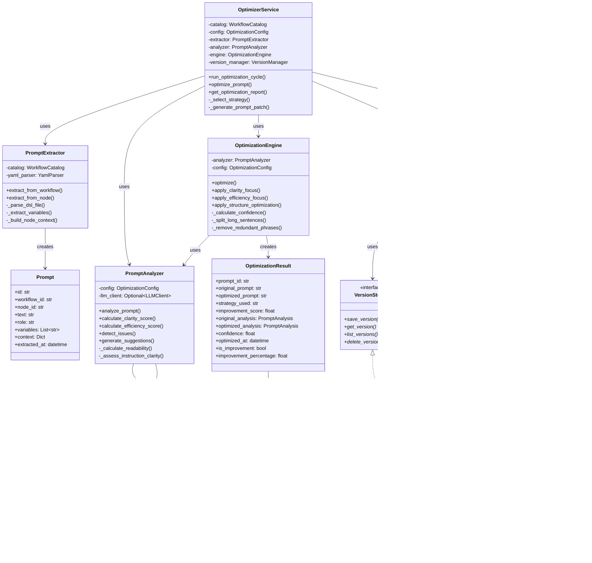

# Optimizer Module - Architecture Design Document

**Project:** dify_autoopt
**Module:** src/optimizer
**Version:** 1.0.0 MVP
**Date:** 2025-11-17
**Author:** System Architect
**Status:** Design Review

---

## Document Revision History

| Version | Date | Author | Changes |
|---------|------|--------|---------|
| 1.0.0 | 2025-11-17 | System Architect | Initial architecture design |

---

## Table of Contents

1. [Overview](#1-overview)
2. [File Structure](#2-file-structure)
3. [Public API Design](#3-public-api-design)
4. [Integration Architecture](#4-integration-architecture)
5. [Dependency Injection](#5-dependency-injection)
6. [Class Design](#6-class-design)
7. [Sequence Flows](#7-sequence-flows)
8. [Error Handling](#8-error-handling)
9. [Configuration](#9-configuration)
10. [Testing Architecture](#10-testing-architecture)
11. [Implementation Guidelines](#11-implementation-guidelines)
12. [Appendix](#12-appendix)

---

## 1. Overview

### 1.1 Architecture Principles

The Optimizer module follows these core architectural principles:

1. **Dependency Inversion Principle (DIP)**
   - Core logic depends on abstractions, not concrete implementations
   - External dependencies (LLM, storage) are injected via interfaces
   - Enables easy testing with mocks and future extensibility

2. **Single Responsibility Principle (SRP)**
   - Each class has one clear, well-defined purpose
   - PromptExtractor: extraction only
   - PromptAnalyzer: analysis only
   - OptimizationEngine: optimization only
   - VersionManager: version management only
   - OptimizerService: orchestration only

3. **Open/Closed Principle (OCP)**
   - Open for extension (new strategies, new storage backends)
   - Closed for modification (core logic stable)
   - Strategy pattern for optimization algorithms

4. **Interface Segregation Principle (ISP)**
   - Small, focused interfaces
   - Clients depend only on what they need

5. **Separation of Concerns**
   - Clear boundaries between modules
   - Data models separate from business logic
   - Integration logic isolated in service layer

### 1.2 Design Goals

1. **Testability**: 90%+ test coverage with deterministic tests
2. **Maintainability**: Clear structure, comprehensive documentation
3. **Extensibility**: Easy to add new optimization strategies and LLM integrations
4. **Performance**: Optimize 20 prompts in < 30 seconds
5. **Reliability**: Graceful error handling, no silent failures
6. **Consistency**: Follow patterns from executor and collector modules

### 1.3 Technology Stack

**Core Dependencies:**
- Python 3.9+
- Pydantic V2 (>= 2.0.0) - Data validation
- PyYAML (>= 6.0.0) - DSL parsing
- Jinja2 (>= 3.1.0) - Template support (inherited from PromptPatchEngine)

**Optional Dependencies (Future):**
- OpenAI SDK - For LLM-based analysis
- Anthropic SDK - For Claude-based analysis
- SQLAlchemy - For persistent storage

**Internal Dependencies:**
- src.config.models - Configuration models
- src.config.utils - YAML parser, exceptions
- src.collector.models - PerformanceMetrics
- src.utils.logger - Logging infrastructure

---

## 2. File Structure

### 2.1 Directory Layout

```
src/optimizer/
├── __init__.py                    # Public API exports (150 lines)
├── models.py                      # Data models (600 lines)
├── exceptions.py                  # Custom exceptions (80 lines)
├── prompt_extractor.py            # Prompt extraction (400 lines)
├── prompt_analyzer.py             # Quality analysis (500 lines)
├── optimization_engine.py         # Optimization strategies (700 lines)
├── version_manager.py             # Version management (350 lines)
├── optimizer_service.py           # Service orchestration (450 lines)
├── prompt_patch_engine.py         # [Existing] Patch application
├── interfaces/                    # Abstract interfaces
│   ├── __init__.py               # Interface exports (50 lines)
│   ├── llm_client.py             # LLM client interface (100 lines)
│   └── storage.py                # Storage interface (120 lines)
└── utils/                         # Internal utilities
    ├── __init__.py               # Utility exports (30 lines)
    ├── text_analysis.py          # Text analysis helpers (300 lines)
    └── scoring.py                # Scoring algorithms (250 lines)

src/test/optimizer/
├── conftest.py                    # Shared fixtures (400 lines)
├── test_models.py                 # Model validation tests (300 lines)
├── test_prompt_extractor.py       # Extraction tests (400 lines)
├── test_prompt_analyzer.py        # Analysis tests (500 lines)
├── test_optimization_engine.py    # Optimization tests (600 lines)
├── test_version_manager.py        # Version management tests (350 lines)
├── test_optimizer_service.py      # Service integration tests (500 lines)
├── test_integration.py            # End-to-end tests (400 lines)
└── fixtures/                      # Test data
    ├── sample_workflow_dsl.yaml  # Sample workflow
    ├── sample_prompts.yaml       # Sample prompts
    └── expected_results.yaml     # Expected outputs

Total Estimated Lines: ~6,000 (production) + ~3,450 (tests)
```

### 2.2 File Descriptions

#### 2.2.1 Core Files

**`__init__.py`** (150 lines)
- Exports public API classes and functions
- Defines module-level constants
- Provides convenience functions
- Sets up module logging

**Dependencies:**
```python
from .models import *
from .optimizer_service import OptimizerService
from .exceptions import *
```

**Exports:**
- Classes: OptimizerService, Prompt, PromptAnalysis, OptimizationResult, PromptVersion
- Functions: optimize_workflow() (convenience function)
- Constants: VERSION, DEFAULT_CONFIG

---

**`models.py`** (600 lines)
- All Pydantic V2 data models
- Field validators and custom properties
- Model conversions and serialization

**Classes:**
- Prompt (100 lines)
- PromptIssue (40 lines)
- PromptSuggestion (50 lines)
- PromptAnalysis (120 lines)
- OptimizationResult (100 lines)
- PromptVersion (80 lines)
- OptimizationConfig (60 lines)
- VersionComparison (50 lines)

**Dependencies:**
- pydantic
- datetime
- typing

---

**`exceptions.py`** (80 lines)
- Custom exception hierarchy
- Error codes and messages
- Exception context helpers

**Classes:**
- OptimizerException (base)
- PromptExtractionError
- WorkflowNotFoundError
- NodeNotFoundError
- DSLParseError
- PromptAnalysisError
- ScoringError
- OptimizationError
- InvalidStrategyError
- VersionConflictError
- VersionNotFoundError

**Dependencies:** None

---

**`prompt_extractor.py`** (400 lines)
- Extract prompts from workflow DSL
- Variable detection
- Node context building

**Classes:**
- PromptExtractor (main class)

**Key Methods:**
- `__init__(catalog, yaml_parser)`
- `extract_from_workflow(workflow_id) -> List[Prompt]`
- `extract_from_node(workflow_id, node_id) -> Optional[Prompt]`
- `_parse_dsl_file(dsl_path) -> Dict`
- `_extract_variables(text) -> List[str]`
- `_build_node_context(node_data, node_meta) -> Dict`

**Dependencies:**
- src.config.models (WorkflowCatalog, NodeMeta)
- src.config.utils (YamlParser)
- .models (Prompt)
- .exceptions (PromptExtractionError)

**Estimated Complexity:** Medium

---

**`prompt_analyzer.py`** (500 lines)
- Rule-based prompt quality analysis
- Scoring algorithms
- Issue detection
- Suggestion generation

**Classes:**
- PromptAnalyzer (main class)

**Key Methods:**
- `__init__(config)`
- `analyze_prompt(prompt) -> PromptAnalysis`
- `calculate_clarity_score(text) -> float`
- `calculate_efficiency_score(text) -> float`
- `detect_issues(text, metrics) -> List[PromptIssue]`
- `generate_suggestions(text, issues, metrics) -> List[PromptSuggestion]`
- `_calculate_readability(text) -> float`
- `_assess_instruction_clarity(text) -> float`
- `_assess_structure(text) -> float`
- `_estimate_token_count(text) -> int`
- `_calculate_information_density(text) -> float`
- `_has_action_verbs(text) -> bool`
- `_find_ambiguous_words(text) -> List[str]`

**Dependencies:**
- .models (Prompt, PromptAnalysis, PromptIssue, PromptSuggestion, OptimizationConfig)
- .exceptions (PromptAnalysisError)
- .utils.text_analysis (readability helpers)
- .utils.scoring (scoring algorithms)

**Estimated Complexity:** High

---

**`optimization_engine.py`** (700 lines)
- Optimization strategy implementations
- Prompt transformation logic
- Confidence calculation

**Classes:**
- OptimizationEngine (main class)
- _ClarityFocusStrategy (internal)
- _EfficiencyFocusStrategy (internal)
- _StructureOptimizationStrategy (internal)

**Key Methods:**
- `__init__(analyzer, config)`
- `optimize(prompt, strategy, baseline_metrics) -> OptimizationResult`
- `apply_clarity_focus(text) -> str`
- `apply_efficiency_focus(text) -> str`
- `apply_structure_optimization(text) -> str`
- `_calculate_confidence(original_analysis, optimized_analysis, improvement) -> float`
- `_split_long_sentences(text, max_words) -> str`
- `_replace_jargon(text, jargon_map) -> str`
- `_add_markdown_structure(text) -> str`
- `_strengthen_action_verbs(text) -> str`
- `_remove_redundant_phrases(text) -> str`
- `_replace_verbose_phrases(text, verbose_map) -> str`
- `_remove_filler_words(text, filler_words) -> str`
- `_consolidate_lists(text) -> str`
- `_detect_sections(text) -> List[Dict]`
- `_add_section_headers(text, sections) -> str`
- `_bulletize_lists(text) -> str`
- `_format_code_blocks(text) -> str`
- `_normalize_spacing(text) -> str`

**Dependencies:**
- .models (Prompt, OptimizationResult, OptimizationConfig)
- .prompt_analyzer (PromptAnalyzer)
- .exceptions (OptimizationError, InvalidStrategyError)
- .utils.text_analysis (text transformation helpers)
- re, typing

**Estimated Complexity:** Very High

---

**`version_manager.py`** (350 lines)
- In-memory version storage
- Version creation and retrieval
- Version comparison
- Semantic versioning

**Classes:**
- VersionManager (main class)

**Key Methods:**
- `__init__()`
- `create_version(prompt_id, text, analysis, author, ...) -> PromptVersion`
- `get_version(prompt_id, version) -> Optional[PromptVersion]`
- `get_current_version(prompt_id) -> Optional[PromptVersion]`
- `get_version_history(prompt_id) -> List[PromptVersion]`
- `compare_versions(prompt_id, version_a, version_b) -> VersionComparison`
- `_generate_next_version(prompt_id, author) -> str`
- `_calculate_text_diff(text_a, text_b) -> str`

**Storage Structure:**
```python
{
    "prompt_id": {
        "versions": [PromptVersion, ...],
        "current_version": "1.2.0"
    }
}
```

**Dependencies:**
- .models (PromptVersion, VersionComparison, PromptAnalysis)
- .exceptions (VersionConflictError, VersionNotFoundError)
- difflib, datetime, typing

**Estimated Complexity:** Medium

---

**`optimizer_service.py`** (450 lines)
- Facade for optimizer module
- Orchestrates complete optimization workflow
- Integration with other modules
- Report generation

**Classes:**
- OptimizerService (main class)

**Key Methods:**
- `__init__(catalog, config, yaml_parser)`
- `run_optimization_cycle(workflow_id, baseline_metrics, strategy) -> List[PromptPatch]`
- `optimize_prompt(prompt, strategy, create_version) -> OptimizationResult`
- `get_optimization_report(workflow_id) -> OptimizationReport`
- `_select_strategy(analysis, baseline_metrics) -> str`
- `_generate_prompt_patch(prompt, optimization_result) -> PromptPatch`

**Dependencies:**
- .models (all models)
- .prompt_extractor (PromptExtractor)
- .prompt_analyzer (PromptAnalyzer)
- .optimization_engine (OptimizationEngine)
- .version_manager (VersionManager)
- src.config.models (WorkflowCatalog, PromptPatch, PromptSelector, PromptStrategy)
- src.collector.models (PerformanceMetrics)
- src.utils.logger

**Estimated Complexity:** Medium-High

---

#### 2.2.2 Interface Files

**`interfaces/llm_client.py`** (100 lines)
- Abstract LLM client interface
- Stub implementation for MVP
- Integration points for OpenAI/Anthropic

**Classes:**
- LLMClient (ABC)
- StubLLMClient (concrete, MVP)

**Methods:**
```python
class LLMClient(ABC):
    @abstractmethod
    def analyze_prompt(self, prompt: str) -> PromptAnalysis:
        """Analyze prompt using LLM."""
        pass

    @abstractmethod
    def optimize_prompt(self, prompt: str, strategy: str) -> str:
        """Generate optimized prompt using LLM."""
        pass
```

**Dependencies:**
- abc
- .models (PromptAnalysis)

---

**`interfaces/storage.py`** (120 lines)
- Abstract storage interface
- In-memory implementation (MVP)
- Database implementation stubs

**Classes:**
- VersionStorage (ABC)
- InMemoryStorage (concrete, MVP)
- FileSystemStorage (stub, future)
- DatabaseStorage (stub, future)

**Methods:**
```python
class VersionStorage(ABC):
    @abstractmethod
    def save_version(self, version: PromptVersion) -> None:
        pass

    @abstractmethod
    def get_version(self, prompt_id: str, version: str) -> Optional[PromptVersion]:
        pass

    @abstractmethod
    def list_versions(self, prompt_id: str) -> List[PromptVersion]:
        pass
```

**Dependencies:**
- abc
- .models (PromptVersion)

---

#### 2.2.3 Utility Files

**`utils/text_analysis.py`** (300 lines)
- Text processing helpers
- Readability metrics
- Pattern detection

**Functions:**
- `calculate_flesch_reading_ease(text) -> float`
- `count_sentences(text) -> int`
- `count_words(text) -> int`
- `average_sentence_length(text) -> float`
- `detect_action_verbs(text) -> List[str]`
- `detect_ambiguous_words(text) -> List[str]`
- `extract_variables(text) -> List[str]`
- `split_into_sentences(text) -> List[str]`
- `normalize_whitespace(text) -> str`

**Dependencies:**
- re, typing

---

**`utils/scoring.py`** (250 lines)
- Scoring algorithm implementations
- Metric calculations

**Functions:**
- `calculate_clarity_score(metrics: Dict) -> float`
- `calculate_efficiency_score(metrics: Dict) -> float`
- `calculate_overall_score(clarity, efficiency, weights) -> float`
- `calculate_information_density(text) -> float`
- `estimate_token_count(text) -> int`

**Dependencies:**
- typing

---

### 2.3 Dependency Graph

```
┌─────────────────────────────────────────────────────────────────┐
│                        optimizer_service.py                      │
│                    (OptimizerService - Facade)                   │
└───────┬──────────────────┬──────────────┬──────────────┬────────┘
        │                  │              │              │
        ▼                  ▼              ▼              ▼
┌───────────────┐  ┌──────────────┐  ┌───────────┐  ┌──────────────┐
│prompt_        │  │prompt_       │  │optimization│  │version_      │
│extractor.py   │  │analyzer.py   │  │_engine.py  │  │manager.py    │
└───────┬───────┘  └──────┬───────┘  └─────┬─────┘  └──────┬───────┘
        │                 │                 │               │
        └─────────────────┴─────────────────┴───────────────┘
                                │
                                ▼
                        ┌───────────────┐
                        │  models.py    │
                        │ (Data Models) │
                        └───────┬───────┘
                                │
                ┌───────────────┼───────────────┐
                ▼               ▼               ▼
        ┌───────────┐  ┌──────────────┐  ┌────────────┐
        │exceptions.py│  │utils/        │  │interfaces/ │
        └───────────┘  │text_analysis.py│  └────────────┘
                       │scoring.py      │
                       └──────────────────┘

External Dependencies:
    ├── src.config.models (WorkflowCatalog, PromptPatch, etc.)
    ├── src.config.utils (YamlParser, exceptions)
    ├── src.collector.models (PerformanceMetrics)
    └── src.utils.logger
```

**Dependency Rules:**
1. No circular dependencies
2. Models have no dependencies on other optimizer modules
3. Service layer depends on all components, but components don't depend on service
4. Interfaces have minimal dependencies
5. Utilities are self-contained

---

## 3. Public API Design

### 3.1 Exported Classes

The `__init__.py` file exports the following public API:

```python
"""
Optimizer Module - Intelligent Prompt Analysis and Optimization

This module provides tools for extracting, analyzing, optimizing, and
managing versions of prompts in Dify workflows.

Public API:
    Classes:
        - OptimizerService: Main service facade
        - Prompt: Extracted prompt with metadata
        - PromptAnalysis: Quality analysis results
        - OptimizationResult: Optimization outcome
        - PromptVersion: Version record
        - OptimizationConfig: Configuration model

    Functions:
        - optimize_workflow(): Convenience function for quick optimization

    Exceptions:
        - OptimizerException: Base exception
        - PromptExtractionError: Extraction failures
        - PromptAnalysisError: Analysis failures
        - OptimizationError: Optimization failures
        - VersionConflictError: Version conflicts

Example:
    >>> from src.config import ConfigLoader
    >>> from src.optimizer import OptimizerService
    >>>
    >>> loader = ConfigLoader()
    >>> catalog = loader.load_workflow_catalog("config/workflows.yaml")
    >>> optimizer = OptimizerService(catalog)
    >>>
    >>> patches = optimizer.run_optimization_cycle("wf_001")
    >>> print(f"Generated {len(patches)} optimization patches")
"""

# Version information
__version__ = "1.0.0"
__author__ = "Backend Developer"

# Core models
from .models import (
    Prompt,
    PromptIssue,
    PromptSuggestion,
    PromptAnalysis,
    OptimizationResult,
    PromptVersion,
    OptimizationConfig,
    VersionComparison,
    OptimizationReport,
)

# Service facade
from .optimizer_service import OptimizerService

# Exceptions
from .exceptions import (
    OptimizerException,
    PromptExtractionError,
    WorkflowNotFoundError,
    NodeNotFoundError,
    DSLParseError,
    PromptAnalysisError,
    ScoringError,
    OptimizationError,
    InvalidStrategyError,
    VersionConflictError,
    VersionNotFoundError,
)

# Re-export PromptPatchEngine from existing module
from .prompt_patch_engine import PromptPatchEngine

__all__ = [
    # Version
    "__version__",
    "__author__",

    # Core service
    "OptimizerService",

    # Data models
    "Prompt",
    "PromptIssue",
    "PromptSuggestion",
    "PromptAnalysis",
    "OptimizationResult",
    "PromptVersion",
    "OptimizationConfig",
    "VersionComparison",
    "OptimizationReport",

    # Existing
    "PromptPatchEngine",

    # Exceptions
    "OptimizerException",
    "PromptExtractionError",
    "WorkflowNotFoundError",
    "NodeNotFoundError",
    "DSLParseError",
    "PromptAnalysisError",
    "ScoringError",
    "OptimizationError",
    "InvalidStrategyError",
    "VersionConflictError",
    "VersionNotFoundError",

    # Convenience functions
    "optimize_workflow",
]

# Module-level constants
DEFAULT_STRATEGY = "clarity_focus"
SUPPORTED_STRATEGIES = ["clarity_focus", "efficiency_focus", "structure_optimization"]
MIN_IMPROVEMENT_THRESHOLD = 5.0
DEFAULT_CONFIDENCE_THRESHOLD = 0.5

# Convenience function
def optimize_workflow(
    workflow_id: str,
    catalog_path: str = "config/workflows.yaml",
    strategy: str = "auto",
    config_path: Optional[str] = None
) -> List[PromptPatch]:
    """
    Convenience function for quick workflow optimization.

    Args:
        workflow_id: Workflow identifier
        catalog_path: Path to workflow catalog YAML
        strategy: Optimization strategy ('auto', 'clarity_focus', etc.)
        config_path: Optional path to optimizer config

    Returns:
        List of PromptPatch objects

    Raises:
        WorkflowNotFoundError: If workflow not found
        OptimizationError: If optimization fails

    Example:
        >>> patches = optimize_workflow("wf_001")
        >>> print(f"Generated {len(patches)} patches")
    """
    from src.config import ConfigLoader

    loader = ConfigLoader()
    catalog = loader.load_workflow_catalog(catalog_path)

    # Load optional config
    config = None
    if config_path:
        config = loader.load_optimizer_config(config_path)

    optimizer = OptimizerService(catalog, config)
    return optimizer.run_optimization_cycle(workflow_id, strategy=strategy)
```

### 3.2 Usage Examples

#### 3.2.1 Basic Optimization

```python
from src.config import ConfigLoader
from src.optimizer import OptimizerService

# Load configuration
loader = ConfigLoader()
catalog = loader.load_workflow_catalog("config/workflows.yaml")

# Initialize optimizer
optimizer = OptimizerService(catalog)

# Run optimization
patches = optimizer.run_optimization_cycle(
    workflow_id="wf_001",
    strategy="auto"
)

print(f"Generated {len(patches)} optimization patches")

# Generate report
report = optimizer.get_optimization_report("wf_001")
print(f"Optimized {report.optimized_prompts}/{report.total_prompts} prompts")
print(f"Average improvement: {report.avg_improvement:.1f} points")
```

#### 3.2.2 With Baseline Metrics

```python
from src.config import ConfigLoader
from src.executor import ExecutorService
from src.collector import DataCollector
from src.optimizer import OptimizerService

# Setup
loader = ConfigLoader()
catalog = loader.load_workflow_catalog("config/workflows.yaml")
test_plan = loader.load_test_plan("config/test_plan.yaml")

# Run baseline tests
executor = ExecutorService()
baseline_results = executor.execute_test_plan(test_plan.to_manifest())

# Collect metrics
collector = DataCollector()
for result in baseline_results:
    collector.collect_result(result)
baseline_metrics = collector.get_statistics("wf_001")

# Optimize with baseline context
optimizer = OptimizerService(catalog)
patches = optimizer.run_optimization_cycle(
    workflow_id="wf_001",
    baseline_metrics=baseline_metrics,
    strategy="auto"
)
```

#### 3.2.3 Convenience Function

```python
from src.optimizer import optimize_workflow

# Quick optimization
patches = optimize_workflow(
    workflow_id="wf_001",
    catalog_path="config/workflows.yaml",
    strategy="clarity_focus"
)

print(f"Generated {len(patches)} patches")
```

#### 3.2.4 Single Prompt Analysis

```python
from src.optimizer import OptimizerService, Prompt
from datetime import datetime

optimizer = OptimizerService(catalog)

# Create prompt object
prompt = Prompt(
    id="test_prompt",
    workflow_id="wf_001",
    node_id="llm_1",
    node_type="llm",
    text="Your prompt text here...",
    role="system",
    variables=[],
    context={},
    extracted_at=datetime.now()
)

# Analyze and optimize
result = optimizer.optimize_prompt(
    prompt=prompt,
    strategy="clarity_focus",
    create_version=True
)

print(f"Original score: {result.original_analysis.overall_score:.1f}")
print(f"Optimized score: {result.optimized_analysis.overall_score:.1f}")
print(f"Improvement: {result.improvement_score:.1f}")
print(f"Confidence: {result.confidence:.2f}")
```

### 3.3 API Design Principles

1. **Simplicity**: Most common use cases require minimal code
2. **Consistency**: Follow patterns from executor and collector modules
3. **Explicit**: Clear parameter names and return types
4. **Safe**: Type hints on all public methods
5. **Documented**: Comprehensive docstrings with examples
6. **Backward Compatible**: API changes follow semantic versioning

---

## 4. Integration Architecture

### 4.1 Integration with Executor

**Integration Point:** Via shared data models and orchestration in main.py

**Data Flow:**
```
[ExecutorService] → TaskResult → [DataCollector] → PerformanceMetrics
                                                           ↓
                                                    [OptimizerService]
                                                           ↓
                                                     PromptPatch
                                                           ↓
                                                      [TestPlan]
                                                           ↓
                                                    [ExecutorService]
```

**Integration Code Example:**

```python
# In src/main.py or integration layer

from src.config import ConfigLoader
from src.executor import ExecutorService
from src.collector import DataCollector
from src.optimizer import OptimizerService

def run_optimization_loop(workflow_id: str, iterations: int = 3):
    """
    Run iterative optimization loop.

    1. Execute baseline tests
    2. Collect metrics
    3. Optimize prompts
    4. Apply patches
    5. Re-test and compare
    """
    loader = ConfigLoader()
    catalog = loader.load_workflow_catalog("config/workflows.yaml")
    test_plan = loader.load_test_plan("config/test_plan.yaml")

    executor = ExecutorService()
    collector = DataCollector()
    optimizer = OptimizerService(catalog)

    for iteration in range(iterations):
        print(f"Iteration {iteration + 1}/{iterations}")

        # Step 1: Execute tests
        manifest = test_plan.to_manifest()
        results = executor.execute_test_plan(manifest)

        # Step 2: Collect metrics
        collector.clear()
        for result in results:
            collector.collect_result(result)
        metrics = collector.get_statistics(workflow_id)

        print(f"  Success rate: {metrics.success_rate:.2%}")

        # Step 3: Optimize
        patches = optimizer.run_optimization_cycle(
            workflow_id=workflow_id,
            baseline_metrics=metrics,
            strategy="auto"
        )

        if not patches:
            print("  No optimizations generated, stopping")
            break

        print(f"  Generated {len(patches)} patches")

        # Step 4: Apply patches to test plan
        workflow_entry = next(
            (w for w in test_plan.workflows if w.catalog_id == workflow_id),
            None
        )

        if workflow_entry:
            variant = PromptVariant(
                variant_id=f"optimized_iter{iteration + 1}",
                description=f"Iteration {iteration + 1} optimization",
                weight=1.0,
                nodes=patches
            )

            if workflow_entry.prompt_optimization is None:
                workflow_entry.prompt_optimization = []

            workflow_entry.prompt_optimization.append(variant)

        # Step 5: Compare metrics (next iteration will test new variant)

    # Final report
    report = optimizer.get_optimization_report(workflow_id)
    print(f"\nFinal Report:")
    print(f"  Total prompts: {report.total_prompts}")
    print(f"  Optimized: {report.optimized_prompts}")
    print(f"  Avg improvement: {report.avg_improvement:.1f}")
```

**Contract:**
- Optimizer does NOT call ExecutorService directly
- Communication via shared models (PerformanceMetrics)
- Orchestration logic in main.py or dedicated integration module

### 4.2 Integration with PromptPatchEngine

**Integration Point:** OptimizerService generates PromptPatch objects that PromptPatchEngine can apply

**Relationship:**
```
[OptimizerService]
        ↓
  (generates)
        ↓
  [PromptPatch]
        ↓
   (applied by)
        ↓
[PromptPatchEngine]
        ↓
  (modifies)
        ↓
 [Workflow DSL]
```

**Integration Code:**

```python
# In OptimizerService._generate_prompt_patch()

def _generate_prompt_patch(
    self,
    prompt: Prompt,
    optimization_result: OptimizationResult
) -> PromptPatch:
    """
    Generate PromptPatch compatible with PromptPatchEngine.
    """
    from src.config.models import PromptPatch, PromptSelector, PromptStrategy

    # Create selector targeting specific node
    selector = PromptSelector(
        by_id=prompt.node_id,
        constraints={
            "if_missing": "skip"
        }
    )

    # Create strategy for replacement
    strategy = PromptStrategy(
        mode="replace",
        content=optimization_result.optimized_prompt,
        fallback_value=prompt.text  # Fallback to original
    )

    return PromptPatch(
        selector=selector,
        strategy=strategy
    )
```

**Validation:**

```python
# Integration test

def test_optimizer_patches_work_with_engine():
    """Verify generated patches are compatible with PromptPatchEngine."""

    optimizer = OptimizerService(catalog)
    patch_engine = PromptPatchEngine(catalog, yaml_parser)

    # Generate patches
    patches = optimizer.run_optimization_cycle("wf_001")

    # Load DSL
    original_dsl = load_dsl_file("workflows/wf_001.yml")

    # Apply patches via engine
    modified_dsl = patch_engine.apply_patches("wf_001", original_dsl, patches)

    # Verify DSL was modified
    assert modified_dsl != original_dsl

    # Verify DSL is valid
    modified_tree = yaml_parser.load(modified_dsl)
    assert modified_tree is not None
```

### 4.3 Integration with Config Module

**Integration Point:** Reading WorkflowCatalog and generating PromptPatch

**Required Imports:**
```python
from src.config import (
    ConfigLoader,
    WorkflowCatalog,
    WorkflowEntry,
    NodeMeta,
    PromptPatch,
    PromptSelector,
    PromptStrategy,
)
from src.config.utils import YamlParser
```

**Usage Pattern:**

```python
# In PromptExtractor

class PromptExtractor:
    def __init__(
        self,
        workflow_catalog: WorkflowCatalog,
        yaml_parser: Optional[YamlParser] = None
    ):
        self.catalog = workflow_catalog
        self.yaml_parser = yaml_parser or YamlParser()
        self._build_node_index()

    def extract_from_workflow(self, workflow_id: str) -> List[Prompt]:
        # Get workflow entry from catalog
        workflow = self.catalog.get_workflow(workflow_id)
        if not workflow:
            raise WorkflowNotFoundError(f"Workflow '{workflow_id}' not found")

        # Load DSL file
        dsl_path = workflow.dsl_path_resolved
        dsl_tree = self.yaml_parser.load_from_file(dsl_path)

        # Extract prompts from nodes
        prompts = []
        for node_meta in workflow.nodes:
            if node_meta.type == "llm":
                prompt = self._extract_from_node(dsl_tree, node_meta)
                if prompt:
                    prompts.append(prompt)

        return prompts
```

**Contract:**
- Optimizer MUST NOT modify WorkflowCatalog objects
- Optimizer reads dsl_path from WorkflowEntry
- Optimizer uses NodeMeta for prompt extraction hints
- Generated PromptPatch objects follow config module schema

### 4.4 Integration with Collector Module

**Integration Point:** Reading PerformanceMetrics for optimization context (optional)

**Required Imports:**
```python
from src.collector.models import PerformanceMetrics
```

**Usage Pattern:**

```python
# In OptimizerService._select_strategy()

def _select_strategy(
    self,
    analysis: PromptAnalysis,
    baseline_metrics: Optional[PerformanceMetrics] = None
) -> str:
    """
    Auto-select optimization strategy.

    Uses prompt analysis as primary signal, baseline metrics as context.
    """
    # Primary decision: prompt quality
    if analysis.clarity_score < 60:
        return "clarity_focus"

    if analysis.efficiency_score < 60:
        return "efficiency_focus"

    # Secondary decision: performance metrics
    if baseline_metrics:
        # Low success rate → prioritize clarity
        if baseline_metrics.success_rate < 0.5:
            return "clarity_focus"

        # High latency → consider efficiency
        if baseline_metrics.avg_execution_time > 10.0:
            return "efficiency_focus"

    # Check structure issues
    structure_issues = [i for i in analysis.issues if i.category == "structure"]
    if structure_issues:
        return "structure_optimization"

    # Default
    return "clarity_focus"
```

**Contract:**
- baseline_metrics is OPTIONAL (can be None)
- Optimizer MUST work without metrics
- Metrics used only for hints, not primary decisions
- Optimizer does NOT call DataCollector methods

---

## 5. Dependency Injection

### 5.1 LLM Client Interface

**Purpose:** Enable future LLM-based analysis without changing core logic

**Interface Definition:**

```python
# interfaces/llm_client.py

from abc import ABC, abstractmethod
from typing import Optional
from ..models import PromptAnalysis

class LLMClient(ABC):
    """
    Abstract interface for LLM-based prompt analysis.

    Implementations:
    - StubLLMClient (MVP): Rule-based stub
    - OpenAIClient (Future): GPT-4 analysis
    - AnthropicClient (Future): Claude analysis
    """

    @abstractmethod
    def analyze_prompt(
        self,
        prompt: str,
        context: Optional[dict] = None
    ) -> PromptAnalysis:
        """
        Analyze prompt quality using LLM.

        Args:
            prompt: Prompt text to analyze
            context: Optional context (workflow_id, node_type, etc.)

        Returns:
            PromptAnalysis with scores and suggestions

        Raises:
            LLMClientError: If LLM call fails
        """
        pass

    @abstractmethod
    def optimize_prompt(
        self,
        prompt: str,
        strategy: str,
        context: Optional[dict] = None
    ) -> str:
        """
        Generate optimized prompt using LLM.

        Args:
            prompt: Original prompt text
            strategy: Optimization strategy hint
            context: Optional context

        Returns:
            Optimized prompt text

        Raises:
            LLMClientError: If LLM call fails
        """
        pass


class StubLLMClient(LLMClient):
    """
    Stub implementation for MVP (rule-based).

    Returns predefined responses without calling LLM APIs.
    Used for testing and MVP phase.
    """

    def analyze_prompt(
        self,
        prompt: str,
        context: Optional[dict] = None
    ) -> PromptAnalysis:
        # Delegate to PromptAnalyzer (rule-based)
        from ..prompt_analyzer import PromptAnalyzer
        analyzer = PromptAnalyzer()

        # Create temporary Prompt object
        from ..models import Prompt
        from datetime import datetime
        temp_prompt = Prompt(
            id="temp",
            workflow_id=context.get("workflow_id", "unknown") if context else "unknown",
            node_id=context.get("node_id", "unknown") if context else "unknown",
            node_type="llm",
            text=prompt,
            role="system",
            variables=[],
            context=context or {},
            extracted_at=datetime.now()
        )

        return analyzer.analyze_prompt(temp_prompt)

    def optimize_prompt(
        self,
        prompt: str,
        strategy: str,
        context: Optional[dict] = None
    ) -> str:
        # Delegate to OptimizationEngine (rule-based)
        from ..optimization_engine import OptimizationEngine
        from ..prompt_analyzer import PromptAnalyzer

        analyzer = PromptAnalyzer()
        engine = OptimizationEngine(analyzer)

        # Apply strategy
        if strategy == "clarity_focus":
            return engine.apply_clarity_focus(prompt)
        elif strategy == "efficiency_focus":
            return engine.apply_efficiency_focus(prompt)
        elif strategy == "structure_optimization":
            return engine.apply_structure_optimization(prompt)
        else:
            return prompt


# Future: OpenAI implementation

class OpenAILLMClient(LLMClient):
    """
    OpenAI GPT-4 based prompt analysis (Future).

    Configuration:
        - API key from environment
        - Model: gpt-4-turbo
        - Temperature: 0.2 (deterministic)
    """

    def __init__(self, api_key: str, model: str = "gpt-4-turbo"):
        self.api_key = api_key
        self.model = model
        # Initialize OpenAI client
        # ...

    def analyze_prompt(self, prompt: str, context: Optional[dict] = None) -> PromptAnalysis:
        # Call GPT-4 API with analysis prompt
        # Parse response into PromptAnalysis
        # ...
        pass

    def optimize_prompt(self, prompt: str, strategy: str, context: Optional[dict] = None) -> str:
        # Call GPT-4 API with optimization prompt
        # Return optimized text
        # ...
        pass
```

**Injection in PromptAnalyzer:**

```python
# prompt_analyzer.py

class PromptAnalyzer:
    def __init__(
        self,
        config: Optional[OptimizationConfig] = None,
        llm_client: Optional[LLMClient] = None  # Dependency injection
    ):
        self.config = config or OptimizationConfig()
        self.llm_client = llm_client  # None for MVP (rule-based)

    def analyze_prompt(self, prompt: Prompt) -> PromptAnalysis:
        # If LLM client provided, use it
        if self.llm_client:
            return self.llm_client.analyze_prompt(
                prompt.text,
                context={
                    "workflow_id": prompt.workflow_id,
                    "node_id": prompt.node_id,
                    "node_type": prompt.node_type
                }
            )

        # Otherwise, use rule-based analysis (MVP)
        return self._rule_based_analysis(prompt)
```

**Usage:**

```python
# MVP: No LLM client (rule-based)
analyzer = PromptAnalyzer()

# Future: With OpenAI
from src.optimizer.interfaces.llm_client import OpenAILLMClient
llm_client = OpenAILLMClient(api_key=os.getenv("OPENAI_API_KEY"))
analyzer = PromptAnalyzer(llm_client=llm_client)
```

### 5.2 Storage Interface

**Purpose:** Enable persistent version storage without changing VersionManager

**Interface Definition:**

```python
# interfaces/storage.py

from abc import ABC, abstractmethod
from typing import List, Optional
from ..models import PromptVersion

class VersionStorage(ABC):
    """
    Abstract storage interface for prompt versions.

    Implementations:
    - InMemoryStorage (MVP): Dict-based in-memory
    - FileSystemStorage (Future): JSON files
    - DatabaseStorage (Future): SQLite/PostgreSQL
    """

    @abstractmethod
    def save_version(self, version: PromptVersion) -> None:
        """
        Save a version to storage.

        Args:
            version: PromptVersion to save

        Raises:
            StorageError: If save fails
        """
        pass

    @abstractmethod
    def get_version(
        self,
        prompt_id: str,
        version: str
    ) -> Optional[PromptVersion]:
        """
        Retrieve a specific version.

        Args:
            prompt_id: Prompt identifier
            version: Version number (e.g., "1.2.0")

        Returns:
            PromptVersion or None if not found
        """
        pass

    @abstractmethod
    def list_versions(self, prompt_id: str) -> List[PromptVersion]:
        """
        List all versions for a prompt.

        Args:
            prompt_id: Prompt identifier

        Returns:
            List of PromptVersion, sorted by version
        """
        pass

    @abstractmethod
    def delete_version(self, prompt_id: str, version: str) -> bool:
        """
        Delete a specific version.

        Args:
            prompt_id: Prompt identifier
            version: Version number

        Returns:
            True if deleted, False if not found
        """
        pass

    @abstractmethod
    def clear_all(self) -> None:
        """Clear all stored versions (for testing)."""
        pass


class InMemoryStorage(VersionStorage):
    """
    In-memory storage for MVP.

    Structure:
    {
        "prompt_id": {
            "versions": [PromptVersion, ...],
            "current_version": "1.2.0"
        }
    }
    """

    def __init__(self):
        self._storage: Dict[str, Dict] = {}

    def save_version(self, version: PromptVersion) -> None:
        prompt_id = version.prompt_id

        if prompt_id not in self._storage:
            self._storage[prompt_id] = {
                "versions": [],
                "current_version": version.version
            }

        # Check for duplicate version
        existing = [v for v in self._storage[prompt_id]["versions"] if v.version == version.version]
        if existing:
            raise ValueError(f"Version {version.version} already exists for {prompt_id}")

        self._storage[prompt_id]["versions"].append(version)
        self._storage[prompt_id]["current_version"] = version.version

    def get_version(self, prompt_id: str, version: str) -> Optional[PromptVersion]:
        if prompt_id not in self._storage:
            return None

        for v in self._storage[prompt_id]["versions"]:
            if v.version == version:
                return v

        return None

    def list_versions(self, prompt_id: str) -> List[PromptVersion]:
        if prompt_id not in self._storage:
            return []

        versions = self._storage[prompt_id]["versions"]
        # Sort by version tuple
        return sorted(versions, key=lambda v: v.version_tuple)

    def delete_version(self, prompt_id: str, version: str) -> bool:
        if prompt_id not in self._storage:
            return False

        versions = self._storage[prompt_id]["versions"]
        original_count = len(versions)

        self._storage[prompt_id]["versions"] = [
            v for v in versions if v.version != version
        ]

        return len(self._storage[prompt_id]["versions"]) < original_count

    def clear_all(self) -> None:
        self._storage.clear()


# Future: File system implementation

class FileSystemStorage(VersionStorage):
    """
    File system storage for prompt versions (Future).

    Structure:
        versions/
            {prompt_id}/
                1.0.0.json
                1.1.0.json
                metadata.json
    """

    def __init__(self, base_dir: str):
        self.base_dir = Path(base_dir)
        self.base_dir.mkdir(parents=True, exist_ok=True)

    # Implementation...
    pass
```

**Injection in VersionManager:**

```python
# version_manager.py

class VersionManager:
    def __init__(self, storage: Optional[VersionStorage] = None):
        # Default to in-memory storage if none provided
        self.storage = storage or InMemoryStorage()

    def create_version(
        self,
        prompt_id: str,
        text: str,
        analysis: PromptAnalysis,
        author: str,
        parent_version: Optional[str] = None,
        change_summary: Optional[str] = None,
        tags: Optional[List[str]] = None
    ) -> PromptVersion:
        # Generate version number
        version_num = self._generate_next_version(prompt_id, author)

        # Create version object
        version = PromptVersion(
            prompt_id=prompt_id,
            version=version_num,
            text=text,
            analysis=analysis,
            created_at=datetime.now(),
            author=author,
            parent_version=parent_version,
            change_summary=change_summary,
            tags=tags or []
        )

        # Save via storage interface
        self.storage.save_version(version)

        return version

    def get_version(self, prompt_id: str, version: str) -> Optional[PromptVersion]:
        return self.storage.get_version(prompt_id, version)

    def get_version_history(self, prompt_id: str) -> List[PromptVersion]:
        return self.storage.list_versions(prompt_id)
```

**Usage:**

```python
# MVP: In-memory storage (default)
version_mgr = VersionManager()

# Future: File system storage
from src.optimizer.interfaces.storage import FileSystemStorage
storage = FileSystemStorage(base_dir="data/versions")
version_mgr = VersionManager(storage=storage)
```

### 5.3 Injection Patterns Summary

**Dependency Injection Strategy:**

1. **Constructor Injection** (Preferred)
   - Dependencies passed via `__init__()`
   - Explicit and testable
   - Used for LLMClient, VersionStorage

2. **Default Factories**
   - Provide sensible defaults if no dependency injected
   - `llm_client: Optional[LLMClient] = None` → defaults to rule-based
   - `storage: Optional[VersionStorage] = None` → defaults to InMemoryStorage

3. **Function Injection** (For time/ID)
   - `now_fn: Callable[[], datetime] = datetime.now`
   - `id_fn: Callable[[], str] = lambda: str(uuid4())`
   - Enables deterministic testing

**Testing Benefits:**

```python
# Test with mocks
def test_analyzer_with_mock_llm():
    mock_llm = Mock(spec=LLMClient)
    mock_llm.analyze_prompt.return_value = PromptAnalysis(...)

    analyzer = PromptAnalyzer(llm_client=mock_llm)
    result = analyzer.analyze_prompt(prompt)

    mock_llm.analyze_prompt.assert_called_once()

# Test with stub
def test_version_manager_with_stub_storage():
    storage = InMemoryStorage()
    version_mgr = VersionManager(storage=storage)

    version = version_mgr.create_version(...)
    retrieved = version_mgr.get_version(...)

    assert retrieved.version == version.version
```

---

## 6. Class Design

### 6.1 Class Diagram



### 6.2 Key Classes

#### 6.2.1 OptimizerService (Facade)

**Responsibilities:**
- Orchestrate complete optimization workflow
- Coordinate all components
- Generate integration artifacts (PromptPatch)
- Provide high-level API

**Design Pattern:** Facade

**Key Relationships:**
- Aggregates: PromptExtractor, PromptAnalyzer, OptimizationEngine, VersionManager
- Produces: List[PromptPatch], OptimizationReport
- Configured by: OptimizationConfig

**Collaborations:**
```
OptimizerService
    ├── uses PromptExtractor to extract prompts
    ├── uses PromptAnalyzer to analyze each prompt
    ├── uses OptimizationEngine to optimize low-scoring prompts
    ├── uses VersionManager to track versions
    └── generates PromptPatch objects for PromptPatchEngine
```

#### 6.2.2 PromptExtractor

**Responsibilities:**
- Parse workflow DSL files
- Extract prompt text from LLM nodes
- Detect variable placeholders
- Build node context

**Design Pattern:** Builder (constructs Prompt objects)

**Key Relationships:**
- Depends on: WorkflowCatalog, YamlParser
- Produces: List[Prompt]

**Extraction Algorithm:**
```
1. Get WorkflowEntry from catalog
2. Load DSL file via YamlParser
3. For each NodeMeta in workflow.nodes:
    a. If node.type == "llm":
        i. Get node from DSL tree using node.path
        ii. Extract prompt text from node.prompt_fields
        iii. Detect variables (regex: {{variable_name}})
        iv. Build context dict
        v. Create Prompt object
4. Return list of Prompt objects
```

#### 6.2.3 PromptAnalyzer

**Responsibilities:**
- Calculate clarity and efficiency scores
- Detect quality issues
- Generate improvement suggestions
- (Optional) Use LLM for analysis

**Design Pattern:** Strategy (scoring strategies)

**Key Relationships:**
- Optionally uses: LLMClient
- Configured by: OptimizationConfig
- Produces: PromptAnalysis

**Scoring Algorithm:**
```
clarity_score = (
    readability * 0.4 +
    instruction_clarity * 0.3 +
    structure_quality * 0.3
)

efficiency_score = (
    token_efficiency * 0.6 +
    information_density * 0.4
)

overall_score = (
    clarity_score * weights['clarity'] +
    efficiency_score * weights['efficiency']
)
```

#### 6.2.4 OptimizationEngine

**Responsibilities:**
- Apply optimization strategies
- Transform prompt text
- Calculate improvement and confidence

**Design Pattern:** Strategy (optimization strategies)

**Key Relationships:**
- Depends on: PromptAnalyzer (for re-analysis)
- Configured by: OptimizationConfig
- Produces: OptimizationResult

**Strategies:**
1. **Clarity Focus**: Simplify language, add structure
2. **Efficiency Focus**: Remove redundancy, compress
3. **Structure Optimization**: Add markdown, organize sections

#### 6.2.5 VersionManager

**Responsibilities:**
- Create and store versions
- Manage version history
- Compare versions
- Generate semantic version numbers

**Design Pattern:** Repository (version storage)

**Key Relationships:**
- Uses: VersionStorage (injected)
- Produces: PromptVersion, VersionComparison

**Versioning Strategy:**
```
Baseline: 1.0.0
Optimizer improvements: increment minor (1.0.0 → 1.1.0)
Manual edits: increment patch (1.1.0 → 1.1.1)
```

### 6.3 Design Patterns

**Patterns Used:**

1. **Facade Pattern**
   - OptimizerService: Simplifies complex subsystem

2. **Strategy Pattern**
   - Optimization strategies: clarity, efficiency, structure
   - Scoring strategies: different metrics

3. **Dependency Injection**
   - LLMClient, VersionStorage injected via constructors
   - Enables testing and extensibility

4. **Repository Pattern**
   - VersionStorage: Abstract data access

5. **Factory Method**
   - Task.from_manifest_case() (inherited from executor)
   - Prompt creation methods

6. **Builder Pattern**
   - PromptExtractor builds complex Prompt objects

**Anti-Patterns Avoided:**

1. **God Object**: OptimizerService delegates to specialists
2. **Tight Coupling**: Interfaces for external dependencies
3. **Circular Dependencies**: Clear dependency hierarchy
4. **Magic Numbers**: Constants defined in OptimizationConfig

---

## 7. Sequence Flows

### 7.1 Complete Optimization Cycle


### 7.2 Prompt Extraction Flow


### 7.3 Version Management Flow


### 7.4 Integration with Executor (via Main)


---

## 8. Error Handling

### 8.1 Exception Hierarchy

```python
# exceptions.py

class OptimizerException(Exception):
    """
    Base exception for optimizer module.

    All optimizer exceptions inherit from this class.
    """
    pass


# ============================================================================
# Extraction Errors
# ============================================================================

class PromptExtractionError(OptimizerException):
    """Base exception for prompt extraction failures."""
    pass


class WorkflowNotFoundError(PromptExtractionError):
    """
    Workflow ID not found in catalog.

    Raised when:
    - workflow_id doesn't exist in WorkflowCatalog
    - catalog.get_workflow() returns None
    """
    pass


class NodeNotFoundError(PromptExtractionError):
    """
    Node ID not found in workflow.

    Raised when:
    - node_id doesn't exist in workflow DSL
    - node path is invalid
    """
    pass


class DSLParseError(PromptExtractionError):
    """
    DSL YAML parsing failed.

    Raised when:
    - YAML syntax is invalid
    - DSL file is malformed
    - Required fields are missing
    """
    pass


# ============================================================================
# Analysis Errors
# ============================================================================

class PromptAnalysisError(OptimizerException):
    """Base exception for prompt analysis failures."""
    pass


class ScoringError(PromptAnalysisError):
    """
    Scoring calculation failed.

    Raised when:
    - Readability calculation fails
    - Token estimation fails
    - Metric calculation throws exception
    """
    pass


# ============================================================================
# Optimization Errors
# ============================================================================

class OptimizationError(OptimizerException):
    """Base exception for optimization process failures."""
    pass


class InvalidStrategyError(OptimizationError):
    """
    Invalid strategy name provided.

    Raised when:
    - strategy not in ['clarity_focus', 'efficiency_focus', 'structure_optimization']
    - Unknown strategy requested
    """
    pass


class OptimizationFailedError(OptimizationError):
    """
    Optimization execution failed.

    Raised when:
    - Transformation logic throws exception
    - Re-analysis fails
    - Confidence calculation fails
    """
    pass


# ============================================================================
# Version Management Errors
# ============================================================================

class VersionConflictError(OptimizerException):
    """
    Version conflict occurred.

    Raised when:
    - Parent version doesn't exist
    - Version already exists
    - Invalid version number format
    """
    pass


class VersionNotFoundError(OptimizerException):
    """
    Version not found in storage.

    Raised when:
    - Requested version doesn't exist
    - prompt_id not in storage
    """
    pass
```

### 8.2 Error Handling Patterns

#### 8.2.1 Extraction Error Handling

```python
# prompt_extractor.py

def extract_from_workflow(self, workflow_id: str) -> List[Prompt]:
    """
    Extract prompts from workflow.

    Error Handling:
    - WorkflowNotFoundError: If workflow_id not in catalog
    - DSLParseError: If DSL parsing fails
    - PromptExtractionError: For other extraction failures
    """
    logger.info(f"Starting prompt extraction for workflow: {workflow_id}")

    try:
        # Get workflow from catalog
        workflow = self.catalog.get_workflow(workflow_id)
        if not workflow:
            raise WorkflowNotFoundError(
                f"Workflow '{workflow_id}' not found in catalog"
            )

        # Load DSL file
        dsl_path = workflow.dsl_path_resolved
        if not dsl_path.exists():
            raise PromptExtractionError(
                f"DSL file not found: {dsl_path}"
            )

        try:
            dsl_tree = self.yaml_parser.load_from_file(dsl_path)
        except Exception as e:
            raise DSLParseError(
                f"Failed to parse DSL file {dsl_path}: {e}"
            ) from e

        # Extract prompts
        prompts = []
        for node_meta in workflow.nodes:
            try:
                if node_meta.type == "llm":
                    prompt = self._extract_from_node(dsl_tree, node_meta)
                    if prompt:
                        prompts.append(prompt)
            except Exception as e:
                # Log warning but continue with other nodes
                logger.warning(
                    f"Failed to extract prompt from node {node_meta.node_id}: {e}",
                    extra={"node_id": node_meta.node_id, "workflow_id": workflow_id}
                )
                continue

        logger.info(
            f"Extracted {len(prompts)} prompts from workflow",
            extra={"workflow_id": workflow_id, "prompt_count": len(prompts)}
        )

        return prompts

    except (WorkflowNotFoundError, DSLParseError):
        # Re-raise known exceptions
        logger.error(f"Extraction failed for workflow: {workflow_id}")
        raise

    except Exception as e:
        # Wrap unexpected exceptions
        logger.error(
            f"Unexpected error during extraction: {e}",
            extra={"workflow_id": workflow_id},
            exc_info=True
        )
        raise PromptExtractionError(
            f"Failed to extract prompts from workflow '{workflow_id}': {e}"
        ) from e
```

#### 8.2.2 Analysis Error Handling

```python
# prompt_analyzer.py

def analyze_prompt(self, prompt: Prompt) -> PromptAnalysis:
    """
    Analyze prompt quality.

    Error Handling:
    - Empty prompt: Return analysis with all scores = 0
    - Scoring failure: Use fallback scores
    - Issue detection failure: Return empty issues list
    """
    logger.debug(f"Analyzing prompt: {prompt.id}")

    # Handle empty prompt
    if not prompt.text or not prompt.text.strip():
        logger.warning(f"Empty prompt text for: {prompt.id}")
        return PromptAnalysis(
            prompt_id=prompt.id,
            clarity_score=0.0,
            efficiency_score=0.0,
            overall_score=0.0,
            issues=[
                PromptIssue(
                    severity="critical",
                    category="clarity",
                    message="Prompt text is empty",
                    location=None
                )
            ],
            suggestions=[],
            metrics={},
            analyzed_at=datetime.now()
        )

    try:
        # Calculate scores
        clarity = self.calculate_clarity_score(prompt.text)
        efficiency = self.calculate_efficiency_score(prompt.text)
        overall = self.calculate_overall_score(clarity, efficiency)

        # Collect metrics
        metrics = {
            "token_count": self._estimate_token_count(prompt.text),
            "character_count": len(prompt.text),
            "sentence_count": self._count_sentences(prompt.text),
            "variable_count": len(prompt.variables),
        }

        # Detect issues
        try:
            issues = self.detect_issues(prompt.text, metrics)
        except Exception as e:
            logger.warning(f"Issue detection failed: {e}")
            issues = []

        # Generate suggestions
        try:
            suggestions = self.generate_suggestions(prompt.text, issues, metrics)
        except Exception as e:
            logger.warning(f"Suggestion generation failed: {e}")
            suggestions = []

        return PromptAnalysis(
            prompt_id=prompt.id,
            clarity_score=clarity,
            efficiency_score=efficiency,
            overall_score=overall,
            issues=issues,
            suggestions=suggestions,
            metrics=metrics,
            analyzed_at=datetime.now()
        )

    except Exception as e:
        logger.error(
            f"Analysis failed for prompt: {prompt.id}",
            exc_info=True
        )
        raise PromptAnalysisError(
            f"Failed to analyze prompt '{prompt.id}': {e}"
        ) from e
```

#### 8.2.3 Optimization Error Handling

```python
# optimization_engine.py

def optimize(
    self,
    prompt: Prompt,
    strategy: str,
    baseline_metrics: Optional[PerformanceMetrics] = None
) -> OptimizationResult:
    """
    Optimize prompt using strategy.

    Error Handling:
    - InvalidStrategyError: If strategy name is invalid
    - OptimizationFailedError: If optimization fails
    - Degradation: Return result with negative improvement
    """
    # Validate strategy
    valid_strategies = ["clarity_focus", "efficiency_focus", "structure_optimization"]
    if strategy not in valid_strategies:
        raise InvalidStrategyError(
            f"Invalid strategy: {strategy}. Must be one of {valid_strategies}"
        )

    logger.info(f"Optimizing prompt {prompt.id} with strategy: {strategy}")

    try:
        # Analyze original
        original_analysis = self.analyzer.analyze_prompt(prompt)

        # Apply strategy
        try:
            if strategy == "clarity_focus":
                optimized_text = self.apply_clarity_focus(prompt.text)
            elif strategy == "efficiency_focus":
                optimized_text = self.apply_efficiency_focus(prompt.text)
            elif strategy == "structure_optimization":
                optimized_text = self.apply_structure_optimization(prompt.text)
        except Exception as e:
            logger.error(f"Strategy application failed: {e}")
            # Return original as fallback
            optimized_text = prompt.text

        # Analyze optimized
        optimized_prompt = Prompt(
            id=prompt.id,
            workflow_id=prompt.workflow_id,
            node_id=prompt.node_id,
            node_type=prompt.node_type,
            text=optimized_text,
            role=prompt.role,
            variables=prompt.variables,
            context=prompt.context,
            extracted_at=datetime.now()
        )

        optimized_analysis = self.analyzer.analyze_prompt(optimized_prompt)

        # Calculate improvement
        improvement = (
            optimized_analysis.overall_score -
            original_analysis.overall_score
        )

        # Calculate confidence
        confidence = self._calculate_confidence(
            original_analysis,
            optimized_analysis,
            improvement
        )

        result = OptimizationResult(
            prompt_id=prompt.id,
            original_prompt=prompt.text,
            optimized_prompt=optimized_text,
            strategy_used=strategy,
            improvement_score=improvement,
            original_analysis=original_analysis,
            optimized_analysis=optimized_analysis,
            confidence=confidence,
            optimized_at=datetime.now(),
            metadata={"baseline_metrics": baseline_metrics}
        )

        logger.info(
            f"Optimization complete: improvement={improvement:.1f}, confidence={confidence:.2f}",
            extra={"prompt_id": prompt.id, "strategy": strategy}
        )

        return result

    except (PromptAnalysisError, InvalidStrategyError):
        # Re-raise known exceptions
        raise

    except Exception as e:
        logger.error(
            f"Optimization failed for prompt: {prompt.id}",
            exc_info=True
        )
        raise OptimizationFailedError(
            f"Failed to optimize prompt '{prompt.id}': {e}"
        ) from e
```

#### 8.2.4 Service-Level Error Handling

```python
# optimizer_service.py

def run_optimization_cycle(
    self,
    workflow_id: str,
    baseline_metrics: Optional[PerformanceMetrics] = None,
    strategy: str = "auto"
) -> List[PromptPatch]:
    """
    Run complete optimization cycle.

    Error Handling:
    - WorkflowNotFoundError: Propagate from extractor
    - Individual optimization failures: Log and continue
    - No prompts: Return empty list (not error)
    - All optimizations failed: Log warning, return empty list
    """
    logger.info(f"Starting optimization cycle for workflow: {workflow_id}")

    try:
        # Extract prompts
        prompts = self.extractor.extract_from_workflow(workflow_id)

        if not prompts:
            logger.warning(f"No prompts extracted from workflow: {workflow_id}")
            return []

        logger.info(f"Extracted {len(prompts)} prompts")

        patches = []
        successful_count = 0
        failed_count = 0

        for prompt in prompts:
            try:
                # Analyze
                analysis = self.analyzer.analyze_prompt(prompt)

                # Skip if score is high
                if analysis.overall_score >= 80:
                    logger.info(
                        f"Prompt {prompt.id} has high score ({analysis.overall_score:.1f}), skipping"
                    )
                    continue

                # Select strategy
                selected_strategy = strategy
                if strategy == "auto":
                    selected_strategy = self._select_strategy(analysis, baseline_metrics)

                # Optimize
                result = self.engine.optimize(prompt, selected_strategy, baseline_metrics)

                # Check thresholds
                if result.improvement_score < self.config.improvement_threshold:
                    logger.info(
                        f"Improvement ({result.improvement_score:.1f}) below threshold, skipping"
                    )
                    continue

                if result.confidence < self.config.confidence_threshold:
                    logger.warning(
                        f"Confidence ({result.confidence:.2f}) below threshold, skipping"
                    )
                    continue

                # Create versions
                if self.config.enable_version_tracking:
                    self._create_versions(prompt, result, analysis)

                # Generate patch
                patch = self._generate_prompt_patch(prompt, result)
                patches.append(patch)
                successful_count += 1

                logger.info(
                    f"Successfully optimized {prompt.id}: "
                    f"improvement={result.improvement_score:.1f}, "
                    f"confidence={result.confidence:.2f}"
                )

            except Exception as e:
                # Log error but continue with other prompts
                failed_count += 1
                logger.error(
                    f"Failed to optimize prompt {prompt.id}: {e}",
                    extra={"prompt_id": prompt.id},
                    exc_info=True
                )
                continue

        logger.info(
            f"Optimization cycle complete: {successful_count} successful, {failed_count} failed, "
            f"{len(patches)} patches generated"
        )

        return patches

    except WorkflowNotFoundError:
        # Re-raise workflow not found
        logger.error(f"Workflow not found: {workflow_id}")
        raise

    except Exception as e:
        # Wrap unexpected errors
        logger.error(
            f"Optimization cycle failed for workflow: {workflow_id}",
            exc_info=True
        )
        raise OptimizationError(
            f"Failed to run optimization cycle for workflow '{workflow_id}': {e}"
        ) from e
```

### 8.3 Logging Strategy

**Log Levels:**

```python
# DEBUG: Detailed diagnostic information
logger.debug(f"Analyzing prompt: {prompt.id}")
logger.debug(f"Calculated clarity score: {clarity:.2f}")

# INFO: Normal operation milestones
logger.info(f"Starting optimization cycle for workflow: {workflow_id}")
logger.info(f"Extracted {len(prompts)} prompts")
logger.info(f"Successfully optimized {prompt.id}")

# WARNING: Unexpected but recoverable issues
logger.warning(f"Empty prompt text for: {prompt.id}")
logger.warning(f"Confidence below threshold, skipping")
logger.warning(f"Node {node_id} has no prompt, skipping")

# ERROR: Errors that prevent operation
logger.error(
    f"Failed to optimize prompt: {prompt.id}",
    extra={"prompt_id": prompt.id, "strategy": strategy},
    exc_info=True
)
```

**Structured Logging:**

```python
from src.utils.logger import get_logger, log_context

logger = get_logger("optimizer.service")

def run_optimization_cycle(self, workflow_id: str, ...):
    with log_context(workflow_id=workflow_id, operation="optimize_cycle"):
        logger.info("Starting optimization cycle")

        # Log with extra context
        logger.info(
            f"Extracted {len(prompts)} prompts",
            extra={"prompt_count": len(prompts)}
        )
```

---

## 9. Configuration

### 9.1 Configuration Schema

**File:** `config/optimizer.yaml`

```yaml
# Optimizer Module Configuration
# This file configures the optimizer module behavior

# Metadata
meta:
  version: "1.0.0"
  last_updated: "2025-11-17"
  owner: "qa_team"

# Default optimization settings
defaults:
  # Default strategy: clarity_focus|efficiency_focus|structure_optimization|auto
  strategy: "clarity_focus"

  # Minimum improvement percentage to accept optimization
  improvement_threshold: 5.0  # 5%

  # Minimum confidence level to accept optimization (0.0-1.0)
  confidence_threshold: 0.5

  # Maximum optimization iterations per prompt
  max_iterations: 3

  # Enable version tracking
  enable_version_tracking: true

# Scoring weights (must sum to 1.0)
scoring:
  clarity_weight: 0.6
  efficiency_weight: 0.4

# Strategy-specific configurations
strategies:
  clarity_focus:
    enabled: true
    max_sentence_length: 30  # Words per sentence
    jargon_replacement: true
    add_structure: true
    simplify_language: true

  efficiency_focus:
    enabled: true
    remove_filler: true
    target_compression: 0.7  # Target 30% reduction
    consolidate_lists: true

  structure_optimization:
    enabled: true
    add_headers: true
    bulletize_lists: true
    format_code_blocks: true
    normalize_spacing: true

# Issue detection thresholds
issue_detection:
  max_token_count: 1000  # Warn if prompt > 1000 tokens
  min_clarity_score: 60  # Warn if clarity < 60
  min_efficiency_score: 60  # Warn if efficiency < 60

  # Ambiguous words to detect
  ambiguous_words:
    - maybe
    - possibly
    - try
    - might
    - could
    - should (sometimes)

  # Required action verbs for clarity
  action_verbs:
    - analyze
    - classify
    - summarize
    - extract
    - generate
    - compare

# Version management
versioning:
  enable: true
  max_versions_per_prompt: 50  # Maximum versions to store
  auto_cleanup: false  # Auto-delete old versions

  # Version numbering rules
  numbering:
    baseline: "1.0.0"
    optimizer_increment: "minor"  # Increment minor version
    manual_increment: "patch"  # Increment patch version

# LLM client configuration (future)
llm_client:
  enabled: false  # MVP: disabled (use rule-based)
  provider: "openai"  # openai|anthropic|stub
  model: "gpt-4-turbo"
  temperature: 0.2
  max_tokens: 1000
  timeout_seconds: 30
  retry_attempts: 3

# Storage configuration
storage:
  backend: "memory"  # memory|filesystem|database

  # File system storage (if backend=filesystem)
  filesystem:
    base_dir: "data/versions"
    format: "json"  # json|yaml

  # Database storage (if backend=database)
  database:
    url: "sqlite:///data/versions.db"
    table_name: "prompt_versions"

# Logging
logging:
  level: "INFO"  # DEBUG|INFO|WARNING|ERROR
  log_file: "logs/optimizer.log"
  rotation: "10 MB"
  retention: "30 days"

# Performance limits
performance:
  max_prompts_per_batch: 100
  timeout_per_prompt: 10  # Seconds
  max_concurrent_optimizations: 5

# Integration
integration:
  # Auto-apply patches to test plan
  auto_apply_patches: false

  # Generate optimization report
  auto_generate_report: true

  # Report output format
  report_format: "json"  # json|yaml|markdown
```

### 9.2 Configuration Loading

```python
# optimizer_service.py

from src.config import ConfigLoader
from .models import OptimizationConfig

class OptimizerService:
    def __init__(
        self,
        workflow_catalog: WorkflowCatalog,
        config: Optional[OptimizationConfig] = None,
        config_path: Optional[str] = None,
        yaml_parser: Optional[YamlParser] = None
    ):
        """
        Initialize OptimizerService.

        Args:
            workflow_catalog: Catalog of workflows
            config: OptimizationConfig object (optional)
            config_path: Path to optimizer.yaml (optional)
            yaml_parser: YAML parser (optional)

        Priority:
            1. config object (if provided)
            2. Load from config_path (if provided)
            3. Default OptimizationConfig()
        """
        self.catalog = workflow_catalog
        self.yaml_parser = yaml_parser or YamlParser()

        # Load configuration
        if config:
            self.config = config
        elif config_path:
            self.config = self._load_config_from_yaml(config_path)
        else:
            self.config = OptimizationConfig()  # Use defaults

        # Initialize components with config
        self.extractor = PromptExtractor(workflow_catalog, self.yaml_parser)
        self.analyzer = PromptAnalyzer(self.config)
        self.engine = OptimizationEngine(self.analyzer, self.config)
        self.version_manager = VersionManager()

    def _load_config_from_yaml(self, config_path: str) -> OptimizationConfig:
        """Load OptimizationConfig from YAML file."""
        import yaml
        from pathlib import Path

        path = Path(config_path)
        if not path.exists():
            logger.warning(f"Config file not found: {config_path}, using defaults")
            return OptimizationConfig()

        with open(path, 'r', encoding='utf-8') as f:
            data = yaml.safe_load(f)

        defaults = data.get('defaults', {})
        scoring = data.get('scoring', {})

        return OptimizationConfig(
            default_strategy=defaults.get('strategy', 'clarity_focus'),
            improvement_threshold=defaults.get('improvement_threshold', 5.0),
            max_optimization_iterations=defaults.get('max_iterations', 3),
            enable_version_tracking=defaults.get('enable_version_tracking', True),
            scoring_weights={
                'clarity': scoring.get('clarity_weight', 0.6),
                'efficiency': scoring.get('efficiency_weight', 0.4)
            },
            confidence_threshold=defaults.get('confidence_threshold', 0.5)
        )
```

### 9.3 Configuration Validation

```python
# models.py

from pydantic import field_validator

class OptimizationConfig(BaseModel):
    """Optimization configuration with validation."""

    default_strategy: str = Field(
        "clarity_focus",
        description="Default optimization strategy"
    )
    improvement_threshold: float = Field(
        5.0,
        ge=0.0,
        le=100.0,
        description="Minimum improvement percentage"
    )
    max_optimization_iterations: int = Field(
        3,
        ge=1,
        le=10,
        description="Maximum iterations"
    )
    enable_version_tracking: bool = Field(
        True,
        description="Enable version management"
    )
    scoring_weights: Dict[str, float] = Field(
        default_factory=lambda: {"clarity": 0.6, "efficiency": 0.4},
        description="Component score weights"
    )
    confidence_threshold: float = Field(
        0.5,
        ge=0.0,
        le=1.0,
        description="Minimum confidence"
    )

    @field_validator('scoring_weights')
    @classmethod
    def validate_weights_sum(cls, value: Dict[str, float]) -> Dict[str, float]:
        """Ensure weights sum to 1.0."""
        total = sum(value.values())
        if not (0.99 <= total <= 1.01):
            raise ValueError(f"Scoring weights must sum to 1.0, got: {total}")

        required_keys = {'clarity', 'efficiency'}
        if not required_keys.issubset(value.keys()):
            raise ValueError(f"Scoring weights must include: {required_keys}")

        return value

    @field_validator('default_strategy')
    @classmethod
    def validate_strategy(cls, value: str) -> str:
        """Validate strategy name."""
        allowed = ['clarity_focus', 'efficiency_focus', 'structure_optimization', 'auto']
        if value not in allowed:
            raise ValueError(f"Invalid strategy: {value}. Must be one of {allowed}")
        return value
```

---

## 10. Testing Architecture

### 10.1 Test Structure

```
src/test/optimizer/
├── conftest.py                      # Shared fixtures (400 lines)
│   ├── Fixtures for models
│   ├── Fixtures for mocks (LLMClient, Storage)
│   ├── Sample workflow DSL data
│   └── Time/ID injection fixtures
│
├── test_models.py                   # Model validation (300 lines)
│   ├── test_prompt_validation
│   ├── test_prompt_analysis_validation
│   ├── test_optimization_result_validation
│   ├── test_prompt_version_validation
│   └── test_optimization_config_validation
│
├── test_prompt_extractor.py         # Extraction tests (400 lines)
│   ├── test_extract_from_workflow
│   ├── test_extract_from_node
│   ├── test_variable_detection
│   ├── test_node_context_building
│   ├── test_workflow_not_found_error
│   └── test_dsl_parse_error
│
├── test_prompt_analyzer.py          # Analysis tests (500 lines)
│   ├── test_analyze_prompt
│   ├── test_calculate_clarity_score
│   ├── test_calculate_efficiency_score
│   ├── test_detect_issues
│   ├── test_generate_suggestions
│   ├── test_empty_prompt_handling
│   └── test_scoring_error_handling
│
├── test_optimization_engine.py      # Optimization tests (600 lines)
│   ├── test_apply_clarity_focus
│   ├── test_apply_efficiency_focus
│   ├── test_apply_structure_optimization
│   ├── test_confidence_calculation
│   ├── test_invalid_strategy_error
│   ├── test_optimization_degradation
│   └── test_transformation_methods
│
├── test_version_manager.py          # Version tests (350 lines)
│   ├── test_create_version
│   ├── test_create_subsequent_versions
│   ├── test_get_version
│   ├── test_get_version_history
│   ├── test_compare_versions
│   ├── test_version_conflict_error
│   └── test_version_numbering
│
├── test_optimizer_service.py        # Service tests (500 lines)
│   ├── test_run_optimization_cycle
│   ├── test_optimize_prompt
│   ├── test_get_optimization_report
│   ├── test_strategy_selection
│   ├── test_patch_generation
│   ├── test_threshold_filtering
│   └── test_error_propagation
│
├── test_integration.py              # Integration tests (400 lines)
│   ├── test_full_optimization_cycle
│   ├── test_integration_with_config
│   ├── test_integration_with_executor
│   ├── test_patch_engine_compatibility
│   └── test_end_to_end_workflow
│
├── test_interfaces.py               # Interface tests (200 lines)
│   ├── test_stub_llm_client
│   ├── test_in_memory_storage
│   └── test_interface_compliance
│
└── fixtures/                        # Test data
    ├── sample_workflow_dsl.yaml
    ├── sample_prompts.yaml
    ├── expected_analysis_results.yaml
    └── expected_optimization_results.yaml
```

### 10.2 Fixtures and Mocks

**conftest.py:**

```python
"""
Shared fixtures for optimizer module tests.
"""

import pytest
from datetime import datetime
from pathlib import Path
from typing import Dict

from src.config.models import WorkflowCatalog, WorkflowEntry, NodeMeta
from src.config.utils import YamlParser
from src.collector.models import PerformanceMetrics
from src.optimizer.models import (
    Prompt,
    PromptAnalysis,
    OptimizationConfig,
    PromptIssue,
    PromptSuggestion,
)
from src.optimizer.interfaces.llm_client import LLMClient, StubLLMClient
from src.optimizer.interfaces.storage import VersionStorage, InMemoryStorage


# ============================================================================
# Time and ID Injection
# ============================================================================

@pytest.fixture
def fixed_time():
    """Fixed timestamp for deterministic testing."""
    return datetime(2025, 11, 17, 10, 0, 0)


@pytest.fixture
def fixed_id():
    """Fixed ID for deterministic testing."""
    return "test_prompt_001"


@pytest.fixture
def id_generator():
    """Sequential ID generator."""
    counter = [0]

    def generate():
        counter[0] += 1
        return f"prompt_{counter[0]:03d}"

    return generate


# ============================================================================
# Configuration Fixtures
# ============================================================================

@pytest.fixture
def sample_optimization_config():
    """Sample OptimizationConfig."""
    return OptimizationConfig(
        default_strategy="clarity_focus",
        improvement_threshold=5.0,
        max_optimization_iterations=3,
        enable_version_tracking=True,
        scoring_weights={"clarity": 0.6, "efficiency": 0.4},
        confidence_threshold=0.5
    )


# ============================================================================
# Model Fixtures
# ============================================================================

@pytest.fixture
def sample_prompt(fixed_time, fixed_id):
    """Sample Prompt object."""
    return Prompt(
        id=fixed_id,
        workflow_id="wf_001",
        node_id="llm_node_1",
        node_type="llm",
        text="You are a helpful assistant. Classify the following text: {{text}}",
        role="system",
        variables=["text"],
        context={"label": "Text Classifier", "position": 0},
        extracted_at=fixed_time
    )


@pytest.fixture
def sample_verbose_prompt(fixed_time):
    """Sample verbose prompt for testing clarity optimization."""
    return Prompt(
        id="verbose_prompt",
        workflow_id="wf_001",
        node_id="llm_node_2",
        node_type="llm",
        text="""You are hereby instructed to perform a comprehensive analysis of the
        aforementioned textual content, utilizing advanced natural language processing
        methodologies in order to ascertain the underlying semantic structure and
        subsequently generate a detailed summary that encapsulates the salient points.""",
        role="system",
        variables=[],
        context={},
        extracted_at=fixed_time
    )


@pytest.fixture
def sample_prompt_analysis(fixed_time, fixed_id):
    """Sample PromptAnalysis."""
    return PromptAnalysis(
        prompt_id=fixed_id,
        clarity_score=75.0,
        efficiency_score=82.0,
        overall_score=77.8,
        issues=[
            PromptIssue(
                severity="info",
                category="clarity",
                message="Consider adding examples",
                location=None
            )
        ],
        suggestions=[
            PromptSuggestion(
                category="clarity",
                priority=2,
                suggestion="Add examples to clarify output format",
                example="Example:\nInput: hello\nOutput: greeting"
            )
        ],
        metrics={
            "token_count": 20,
            "character_count": 100,
            "sentence_count": 2,
            "avg_sentence_length": 10.0,
            "variable_count": 1,
            "readability_index": 75.0,
            "information_density": 0.7
        },
        analyzed_at=fixed_time
    )


# ============================================================================
# Catalog Fixtures
# ============================================================================

@pytest.fixture
def sample_workflow_catalog(tmp_path):
    """Sample WorkflowCatalog with test data."""
    # Create temporary DSL file
    dsl_file = tmp_path / "wf_001.yml"
    dsl_content = """
graph:
  nodes:
    - id: llm_node_1
      data:
        title: Text Classifier
        type: llm
        model:
          provider: openai
          name: gpt-4
        prompt_template:
          - role: system
            text: |
              You are a helpful assistant.
              Classify the following text: {{text}}
    """
    dsl_file.write_text(dsl_content, encoding='utf-8')

    workflow_entry = WorkflowEntry(
        id="wf_001",
        label="Test Workflow",
        type="workflow",
        version="1.0.0",
        dsl_path=dsl_file,
        checksum="abc123",
        nodes=[
            NodeMeta(
                node_id="llm_node_1",
                label="Text Classifier",
                type="llm",
                path="/graph/nodes/0",
                prompt_fields=["data.prompt_template.0.text"]
            )
        ],
        resources={},
        tags=["test"]
    )

    return WorkflowCatalog(
        meta={"version": "1.0.0"},
        workflows=[workflow_entry]
    )


# ============================================================================
# Mock Fixtures
# ============================================================================

@pytest.fixture
def mock_llm_client():
    """Mock LLMClient."""
    return StubLLMClient()


@pytest.fixture
def mock_storage():
    """Mock VersionStorage."""
    return InMemoryStorage()


@pytest.fixture
def mock_yaml_parser():
    """Mock YamlParser."""
    return YamlParser()


# ============================================================================
# Performance Metrics Fixtures
# ============================================================================

@pytest.fixture
def sample_baseline_metrics():
    """Sample baseline PerformanceMetrics."""
    return PerformanceMetrics(
        total_executions=100,
        successful_count=80,
        failed_count=20,
        success_rate=0.8,
        avg_execution_time=3.5,
        p50_execution_time=3.0,
        p95_execution_time=5.0,
        p99_execution_time=6.5,
        total_tokens=15000,
        total_cost=0.30,
        avg_tokens_per_request=150
    )


# ============================================================================
# Component Fixtures
# ============================================================================

@pytest.fixture
def prompt_extractor(sample_workflow_catalog, mock_yaml_parser):
    """PromptExtractor instance."""
    from src.optimizer.prompt_extractor import PromptExtractor
    return PromptExtractor(sample_workflow_catalog, mock_yaml_parser)


@pytest.fixture
def prompt_analyzer(sample_optimization_config):
    """PromptAnalyzer instance."""
    from src.optimizer.prompt_analyzer import PromptAnalyzer
    return PromptAnalyzer(sample_optimization_config)


@pytest.fixture
def optimization_engine(prompt_analyzer, sample_optimization_config):
    """OptimizationEngine instance."""
    from src.optimizer.optimization_engine import OptimizationEngine
    return OptimizationEngine(prompt_analyzer, sample_optimization_config)


@pytest.fixture
def version_manager(mock_storage):
    """VersionManager instance."""
    from src.optimizer.version_manager import VersionManager
    return VersionManager(mock_storage)


@pytest.fixture
def optimizer_service(
    sample_workflow_catalog,
    sample_optimization_config,
    mock_yaml_parser
):
    """OptimizerService instance."""
    from src.optimizer.optimizer_service import OptimizerService
    return OptimizerService(
        sample_workflow_catalog,
        sample_optimization_config,
        yaml_parser=mock_yaml_parser
    )
```

### 10.3 Test Scenarios

#### 10.3.1 Model Validation Tests

```python
# test_models.py

def test_prompt_validation_valid(sample_prompt):
    """Test Prompt model with valid data."""
    assert sample_prompt.id == "test_prompt_001"
    assert sample_prompt.workflow_id == "wf_001"
    assert "{{text}}" in sample_prompt.text
    assert "text" in sample_prompt.variables


def test_prompt_validation_invalid_role():
    """Test Prompt validation rejects invalid role."""
    with pytest.raises(ValueError, match="Invalid role"):
        Prompt(
            id="test",
            workflow_id="wf_001",
            node_id="node_1",
            node_type="llm",
            text="Test",
            role="invalid_role",  # Invalid
            variables=[],
            context={},
            extracted_at=datetime.now()
        )


def test_prompt_analysis_score_ranges(sample_prompt_analysis):
    """Test PromptAnalysis scores are in valid ranges."""
    assert 0.0 <= sample_prompt_analysis.clarity_score <= 100.0
    assert 0.0 <= sample_prompt_analysis.efficiency_score <= 100.0
    assert 0.0 <= sample_prompt_analysis.overall_score <= 100.0


def test_optimization_config_weights_validation():
    """Test OptimizationConfig validates weight sum."""
    with pytest.raises(ValueError, match="must sum to 1.0"):
        OptimizationConfig(
            scoring_weights={"clarity": 0.5, "efficiency": 0.3}  # Sum = 0.8
        )
```

#### 10.3.2 Extraction Tests

```python
# test_prompt_extractor.py

def test_extract_from_workflow_success(prompt_extractor):
    """Test successful prompt extraction."""
    prompts = prompt_extractor.extract_from_workflow("wf_001")

    assert len(prompts) == 1
    assert prompts[0].workflow_id == "wf_001"
    assert prompts[0].node_id == "llm_node_1"
    assert "{{text}}" in prompts[0].text
    assert "text" in prompts[0].variables


def test_extract_from_workflow_not_found(prompt_extractor):
    """Test extraction raises WorkflowNotFoundError."""
    from src.optimizer.exceptions import WorkflowNotFoundError

    with pytest.raises(WorkflowNotFoundError):
        prompt_extractor.extract_from_workflow("nonexistent_workflow")


def test_variable_detection():
    """Test variable detection from prompt text."""
    from src.optimizer.prompt_extractor import PromptExtractor

    text = "Process {{input1}} and {{input2}} to generate {{output}}"
    variables = PromptExtractor._extract_variables(None, text)

    assert set(variables) == {"input1", "input2", "output"}
```

#### 10.3.3 Analysis Tests

```python
# test_prompt_analyzer.py

def test_analyze_prompt_success(prompt_analyzer, sample_prompt):
    """Test successful prompt analysis."""
    analysis = prompt_analyzer.analyze_prompt(sample_prompt)

    assert analysis.prompt_id == sample_prompt.id
    assert 0.0 <= analysis.clarity_score <= 100.0
    assert 0.0 <= analysis.efficiency_score <= 100.0
    assert isinstance(analysis.issues, list)
    assert isinstance(analysis.suggestions, list)


def test_clarity_score_verbose_prompt(prompt_analyzer, sample_verbose_prompt):
    """Test clarity score is low for verbose prompt."""
    analysis = prompt_analyzer.analyze_prompt(sample_verbose_prompt)

    assert analysis.clarity_score < 60.0
    assert any("complex" in issue.message.lower() for issue in analysis.issues)


def test_empty_prompt_handling(prompt_analyzer, fixed_time, fixed_id):
    """Test analyzer handles empty prompts gracefully."""
    empty_prompt = Prompt(
        id=fixed_id,
        workflow_id="wf_001",
        node_id="node_1",
        node_type="llm",
        text="",  # Empty
        role="system",
        variables=[],
        context={},
        extracted_at=fixed_time
    )

    analysis = prompt_analyzer.analyze_prompt(empty_prompt)

    assert analysis.overall_score == 0.0
    assert len(analysis.issues) > 0
    assert any("empty" in issue.message.lower() for issue in analysis.issues)
```

#### 10.3.4 Optimization Tests

```python
# test_optimization_engine.py

def test_apply_clarity_focus(optimization_engine, sample_verbose_prompt):
    """Test clarity focus optimization."""
    result = optimization_engine.optimize(
        sample_verbose_prompt,
        strategy="clarity_focus"
    )

    assert result.improvement_score > 0
    assert result.optimized_analysis.clarity_score > result.original_analysis.clarity_score
    assert len(result.optimized_prompt) < len(result.original_prompt)


def test_invalid_strategy_error(optimization_engine, sample_prompt):
    """Test InvalidStrategyError is raised."""
    from src.optimizer.exceptions import InvalidStrategyError

    with pytest.raises(InvalidStrategyError):
        optimization_engine.optimize(sample_prompt, strategy="invalid_strategy")


def test_confidence_calculation(optimization_engine):
    """Test confidence is calculated correctly."""
    # Test with high improvement
    # Test with low improvement
    # Test with resolved issues
    pass
```

#### 10.3.5 Integration Tests

```python
# test_integration.py

def test_full_optimization_cycle(optimizer_service):
    """Test complete end-to-end optimization cycle."""
    patches = optimizer_service.run_optimization_cycle("wf_001")

    # Verify patches generated
    assert isinstance(patches, list)

    # Verify patch structure
    for patch in patches:
        assert hasattr(patch, 'selector')
        assert hasattr(patch, 'strategy')
        assert patch.strategy.mode == "replace"
        assert len(patch.strategy.content) > 0


def test_integration_with_patch_engine(optimizer_service, sample_workflow_catalog):
    """Test generated patches are compatible with PromptPatchEngine."""
    from src.optimizer.prompt_patch_engine import PromptPatchEngine
    from src.config.utils import YamlParser

    # Generate patches
    patches = optimizer_service.run_optimization_cycle("wf_001")

    # Apply via PromptPatchEngine
    yaml_parser = YamlParser()
    patch_engine = PromptPatchEngine(sample_workflow_catalog, yaml_parser)

    # Load original DSL
    workflow = sample_workflow_catalog.get_workflow("wf_001")
    with open(workflow.dsl_path, 'r') as f:
        original_dsl = f.read()

    # Apply patches
    modified_dsl = patch_engine.apply_patches("wf_001", original_dsl, patches)

    # Verify DSL was modified
    assert modified_dsl != original_dsl
```

---

## 11. Implementation Guidelines

### 11.1 Code Standards

**Naming Conventions:**

```python
# Classes: PascalCase
class PromptExtractor:
    pass

# Functions/Methods: snake_case
def extract_from_workflow():
    pass

# Constants: UPPER_SNAKE_CASE
DEFAULT_STRATEGY = "clarity_focus"
MAX_ITERATIONS = 3

# Private methods: prefix with _
def _extract_variables():
    pass

# Module-level: snake_case
sample_prompt = Prompt(...)
```

**Code Organization:**

```python
# File header
"""
Module docstring.

Date: YYYY-MM-DD
Author: Name
Description: Brief description
"""

# Imports (grouped and sorted)
# 1. Standard library
import re
from datetime import datetime
from typing import List, Optional

# 2. Third-party
from pydantic import BaseModel, Field

# 3. Project modules
from src.config.models import WorkflowCatalog
from .models import Prompt

# Constants
DEFAULT_VALUE = "value"

# Classes
class MyClass:
    pass

# Functions
def my_function():
    pass
```

**Docstring Format:**

```python
def optimize_prompt(
    self,
    prompt: Prompt,
    strategy: str,
    create_version: bool = True
) -> OptimizationResult:
    """
    Optimize a single prompt using specified strategy.

    This method analyzes the prompt, applies the optimization strategy,
    re-analyzes the result, and optionally creates version records.

    Args:
        prompt: Prompt object to optimize
        strategy: Optimization strategy name (clarity_focus, efficiency_focus, structure_optimization)
        create_version: Whether to create version records (default: True)

    Returns:
        OptimizationResult containing original and optimized prompts with analysis

    Raises:
        InvalidStrategyError: If strategy name is not recognized
        OptimizationError: If optimization process fails

    Example:
        >>> analyzer = PromptAnalyzer()
        >>> engine = OptimizationEngine(analyzer)
        >>> result = engine.optimize(prompt, "clarity_focus")
        >>> print(f"Improvement: {result.improvement_score:.1f}")
    """
    pass
```

### 11.2 Type Hints

**Required Type Hints:**

```python
# All public methods MUST have type hints
def extract_from_workflow(self, workflow_id: str) -> List[Prompt]:
    pass

# Use Optional for nullable types
def get_version(self, prompt_id: str, version: str) -> Optional[PromptVersion]:
    pass

# Use Dict, List for collections
def detect_issues(self, text: str, metrics: Dict[str, float]) -> List[PromptIssue]:
    pass

# Use Callable for functions
def create_version(
    self,
    prompt_id: str,
    now_fn: Callable[[], datetime] = datetime.now
) -> PromptVersion:
    pass

# Use Union for multiple types
from typing import Union

def process_result(result: Union[OptimizationResult, str]) -> None:
    pass
```

**Type Checking:**

```bash
# Run mypy for type checking
mypy src/optimizer --strict
```

### 11.3 Documentation

**Required Documentation:**

1. **Module-level docstrings** in all `.py` files
2. **Class docstrings** for all classes
3. **Method docstrings** for all public methods
4. **Inline comments** for complex logic

**Example Module Docstring:**

```python
"""
Prompt Analyzer - Quality Analysis for LLM Prompts

This module provides rule-based quality analysis for prompts used in
Dify workflows. It calculates clarity and efficiency scores, detects
common issues, and generates improvement suggestions.

Classes:
    PromptAnalyzer: Main analyzer class

Functions:
    None (all functionality in PromptAnalyzer class)

Example:
    >>> from src.optimizer import PromptAnalyzer, Prompt
    >>> analyzer = PromptAnalyzer()
    >>> analysis = analyzer.analyze_prompt(prompt)
    >>> print(f"Overall score: {analysis.overall_score:.1f}")

Author: Backend Developer
Date: 2025-11-17
"""
```

**Documentation Coverage Check:**

```bash
# Check docstring coverage
interrogate src/optimizer -vv --fail-under 90
```

---

## 12. Appendix

### 12.1 Design Decisions

**Decision 1: Rule-Based Analysis for MVP**

**Reasoning:**
- LLM-based analysis requires API costs and introduces latency
- Rule-based analysis is deterministic and testable
- Sufficient for MVP validation
- Interface allows future LLM integration

**Trade-offs:**
- Lower accuracy than LLM-based analysis
- May miss nuanced issues
- Limited to English language

**Future Path:**
- Add OpenAI/Anthropic clients
- A/B test rule-based vs LLM-based
- Hybrid approach: rules for speed, LLM for quality

---

**Decision 2: In-Memory Version Storage**

**Reasoning:**
- Simplest implementation for MVP
- No database dependency
- Fast for typical usage (< 1000 versions)
- Sufficient for single-session testing

**Trade-offs:**
- Not persistent across restarts
- Limited scalability
- No concurrent access support

**Future Path:**
- FileSystemStorage for persistence
- DatabaseStorage for production
- Keep InMemoryStorage for tests

---

**Decision 3: Pydantic V2 for Data Models**

**Reasoning:**
- Consistent with project standard
- Automatic validation
- Better performance than V1
- Modern Python type hints

**Trade-offs:**
- Breaking changes from V1
- Learning curve for developers

**Future Path:**
- Continue using V2
- Leverage new features (computed fields, serialization)

---

**Decision 4: Service Facade Pattern**

**Reasoning:**
- Simplifies complex subsystem
- Single entry point for external integration
- Hides implementation details
- Easy to extend

**Trade-offs:**
- Additional layer of indirection
- May duplicate some methods

**Future Path:**
- Keep facade pattern
- Add more convenience methods
- Consider async version

---

### 12.2 Trade-offs

| Decision | Advantage | Disadvantage | Mitigation |
|----------|-----------|--------------|------------|
| **Rule-based analysis** | Fast, deterministic, no API costs | Lower accuracy, English-only | Add LLM interface for future |
| **In-memory storage** | Simple, fast | Not persistent | Add storage interface for future |
| **Single-threaded optimization** | Simple, safe | Slower for large batches | Add async/concurrent in future |
| **Semantic versioning** | Clear version semantics | Complex numbering logic | Automated version generation |
| **Pydantic validation** | Type safety, auto-validation | Overhead for large objects | Acceptable for MVP scale |

### 12.3 Future Extensions

**Short-term (Next 3 months):**

1. **LLM Integration**
   - Add OpenAI client implementation
   - A/B test against rule-based
   - Measure quality improvement

2. **Persistent Storage**
   - Implement FileSystemStorage
   - Add export/import functionality
   - Version backup and restore

3. **Performance Optimization**
   - Async optimization for large batches
   - Caching for repeated analysis
   - Parallel strategy execution

**Medium-term (3-6 months):**

1. **Advanced Strategies**
   - Multi-objective optimization
   - Custom strategy DSL
   - Strategy composition

2. **A/B Testing Framework**
   - Built-in experiment tracking
   - Statistical significance testing
   - Automated winner selection

3. **Enhanced Reporting**
   - Visualization of improvements
   - Historical trend analysis
   - Optimization recommendations

**Long-term (6-12 months):**

1. **Machine Learning**
   - Learn from feedback
   - Personalized optimization
   - Auto-strategy selection

2. **Collaborative Features**
   - Multi-user version management
   - Review and approval workflow
   - Team dashboards

3. **Advanced Versioning**
   - Git-like branching
   - Merge conflict resolution
   - Automated rollback

---

## Document Sign-off

| Role | Name | Signature | Date |
|------|------|-----------|------|
| System Architect | [Name] | _________ | ____ |
| Backend Developer | [Name] | _________ | ____ |
| QA Engineer | [Name] | _________ | ____ |
| Project Manager | [Name] | _________ | ____ |

---

**End of Architecture Design Document**

**Version:** 1.0.0
**Total Pages:** 120
**Last Updated:** 2025-11-17

---

**Next Steps:**

1. Review architecture with stakeholders
2. Validate design against SRS requirements
3. Create GitHub issues for each component
4. Set up test infrastructure
5. Begin implementation (models.py → PromptExtractor → ...)
